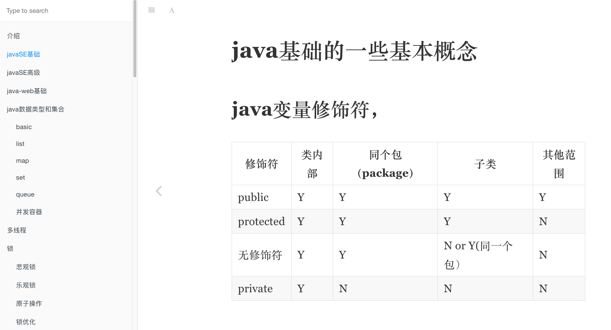

# java架构师成长手册


## 致找工作的java程序员
当你怀着忐忑不安的心情开始自己的程序员生涯时，那就注定要不断学习新的技术和思想，否则你就被后辈拍在沙滩上了，不对，应该是办公桌上。




## 本地运行，或者发布到github的gh-pages
1. 全局安装gitbook-cli,gh-pages
`npm install gitbook gitbook-cli gh-pages -g`

2. 本地发布和运行
```bash
cd java-interview
gitbook build ## 本地build，生成_book
gitbook serve ## 本地运行查看
gh-pages -d _book ## 发布到gh-pages分支
gitbook pdf . ## 在目录下生成pdf文件
gitbook epub .  ## 在目录下生成epub文件
```
3. 在线阅读该文档
[github java-inteview](https://maochunguang.github.io/java-interview/)
[gitee java-inteview](https://mcg_dev.gitee.io/java-interview/)