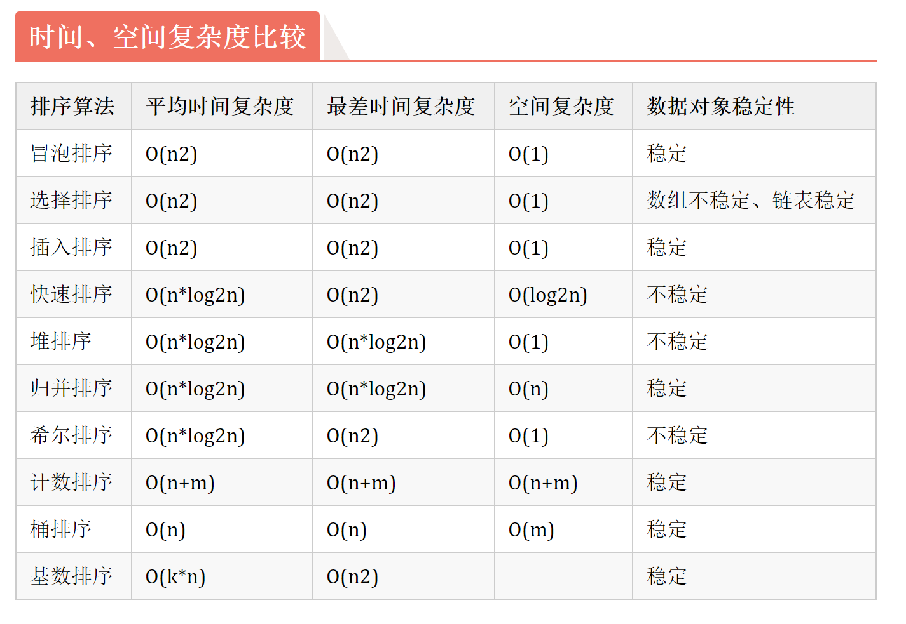

## 排序算法分类


## 快速排序
基本思想：选择一个基准元素,通常选择第一个元素或者最后一个元素,通过一趟扫描，将待排序列分成两部分,一部分比基准元素小,一部分大于等于基准元素,此时基准元素在其排好序后的正确位置,然后再用同样的方法递归地排序划分的两部分。
```java
public class QuickSort {
    public static void main(String[] args) {
        int[] a={49,38,65,97,76,13,27,49,78,34,12,64,1,8};
        System.out.println("排序之前：");
        for (int i = 0; i < a.length; i++) {
            System.out.print(a[i]+" ");
        }
        //快速排序
        quick(a);
        System.out.println();
        System.out.println("排序之后：");
        for (int i = 0; i < a.length; i++) {
            System.out.print(a[i]+" ");
        }
    }

    private static void quick(int[] a) {
        if(a.length>0){
            quickSort(a,0,a.length-1);
        }
    }

    private static void quickSort(int[] a, int low, int high) {
        if(low<high){ //如果不加这个判断递归会无法退出导致堆栈溢出异常
            int middle = getMiddle(a,low,high);
            quickSort(a, 0, middle-1);
            quickSort(a, middle+1, high);
        }
    }

    private static int getMiddle(int[] a, int low, int high) {
        int temp = a[low];//基准元素
        while(low<high){
            //找到比基准元素小的元素位置
            while(low<high && a[high]>=temp){
                high--;
            }
            a[low] = a[high];
            while(low<high && a[low]<=temp){
                low++;
            }
            a[high] = a[low];
        }
        a[low] = temp;
        return low;
    }
}
```
## 插入排序

## 希尔排序

## 冒泡排序

## 归并排序

## 堆排序

## 桶排序
