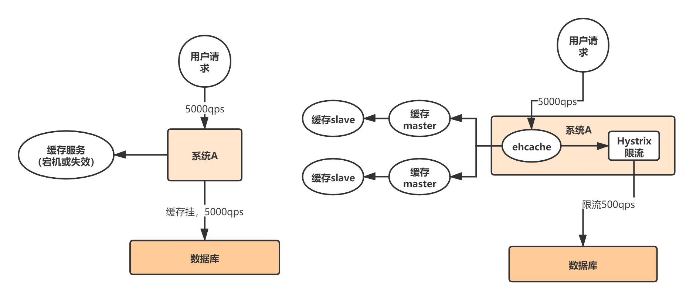

# 缓存

## 什么时候用缓存？
* 数据查询多
* 数据变更少
* 数据查询需要多表联查，耗费时间，

## 缓存一致性如何解决
1. 先删除缓存
2. 更新缓存

## 缓存更新策略
1. 增量更新
2. 每天定时全量更新

## 缓存穿透
**缓存穿透是指查询一个一定不存在的数据**，由于缓存是不命中时被动写的，并且出于容错考虑，如果从存储层查不到数据则不写入缓存，这将导致这个不存在的数据每次请求都要到存储层去查询，失去了缓存的意义。在流量大时，可能DB就挂掉了，要是有人利用不存在的key频繁攻击我们的应用，这就是漏洞。

**解决方案：**
* 采用布隆过滤器，将所有可能存在的数据哈希到一个足够大的bitmap中。
* 如果一个查询返回的数据为空，我们仍然把这个空结果进行缓存，但它的过期时间会很短，最长不超过五分钟。

## 缓存雪崩
我们设置缓存时采用了相同的过期时间，导致缓存在某一时刻同时失效,由于缓存不能命中，导致大量查询到数据库，造成数据库负载过大，导致服务不可用。

**解决办法：**
缓存雪崩的事前事中事后的解决方案如下：

* 事前：Redis 高可用，主从+哨兵，Redis cluster，避免全盘崩溃。
  * 原有的失效时间基础上增加一个随机值，比如1-5分钟随机
* 事中：本地 ehcache 缓存 + hystrix 限流&降级，避免 MySQL 被打死。
* 事后：Redis 持久化，一旦重启，自动从磁盘上加载数据，快速恢复缓存数据。

## 缓存击穿
对于一些设置了过期时间的key，如果这些key可能会在某些时间点被超高并发地访问，是一种非常“热点”的数据。这个时候，需要考虑一个问题：缓存被“击穿”的问题，这个和缓存雪崩的区别在于这里针对某一key缓存，后者则是很多key。

**解决办法：**
1. 若缓存的数据是基本不会发生更新的，则可尝试将该热点数据设置为永不过期。
2. 若缓存的数据更新不频繁，且缓存刷新的整个流程耗时较少的情况下，则可以采用基于 Redis、zookeeper 等分布式中间件的分布式互斥锁，或者本地互斥锁以保证仅少量的请求能请求数据库并重新构建缓存，其余线程则在锁释放后能访问到新缓存。
3. 若缓存的数据更新频繁或者在缓存刷新的流程耗时较长的情况下，可以利用定时线程在缓存过期前主动地重新构建缓存或者延后缓存的过期时间，以保证所有的请求能一直访问到对应的缓存。

