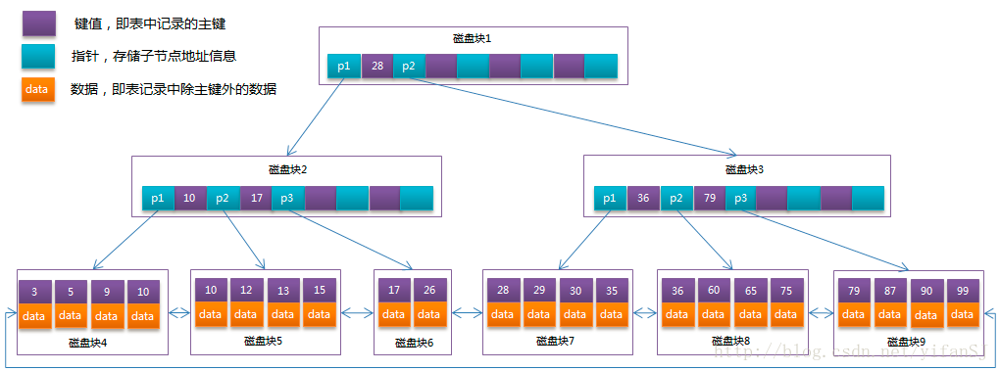
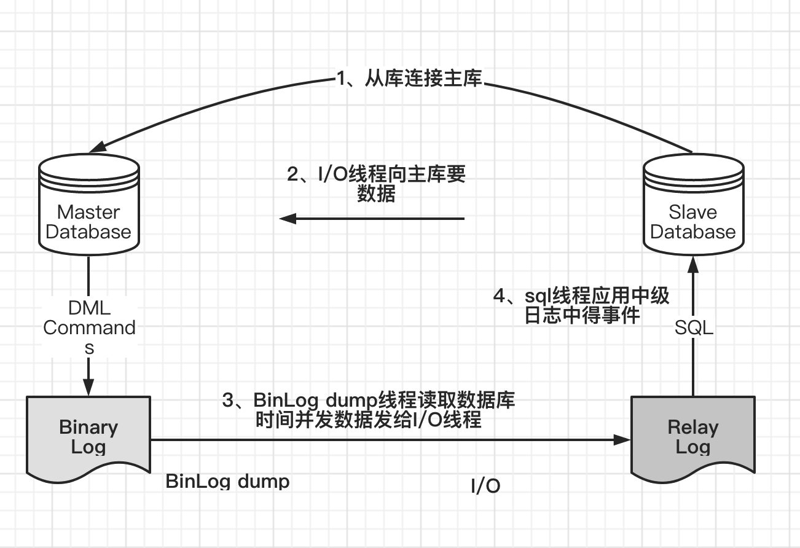

# mysql核心知识点

## 数据库四种事务隔离级别
* ① Serializable (串行化)：可避免脏读、不可重复读、幻读的发生。
* ② Repeatable read (可重复读)：可避免脏读、不可重复读的发生。（默认级别）
* ③ Read committed (读已提交)：可避免脏读的发生。
* ④ Read uncommitted (读未提交)：最低级别，任何情况都无法保证。

## 事务的特性
* A（Atomicity） 原子性
  * 事务是最小的执行单位，不允许分割。事务的原子性确保动作要么全部完成，要么完全不起作用；
* C（Consistency） 一致性
  * 一致性是指事务使得系统从一个一致的状态转换到另一个一致状态。*事务的一致性决定了一个系统设计和实现的复杂度，也导致了事务的不同隔离级别。*
    * **强一致性**：读操作可以立即读到提交的更新操作。
    * **弱一致性**：提交的更新操作，不一定立即会被读操作读到，此种情况会存在一个不一致窗口，指的是读操作可以读到最新值的一段时间。
    * **最终一致性**：是弱一致性的特例。事务更新一份数据，最终一致性保证在没有其他事务更新同样的值的话，最终所有的事务都会读到之前事务更新的最新值。如果没有错误发生，不一致窗口的大小依赖于：通信延迟，系统负载等。
    * **单调一致性**：如果一个进程已经读到一个值，那么后续不会读到更早的值。
    * **会话一致性**：保证客户端和服务器交互的会话过程中，读操作可以读到更新操作后的最新值
* I（Isolation） 隔离性
  * 并发访问数据库时，一个用户的事务不被其他事务所干扰，各并发事务之间数据库是独立的；
* D（Durability） 持久性
  * 一个事务被提交之后。它对数据库中数据的改变是持久的，即使数据库发生故障也不应该对其有任何影响。


## 左连接，右连接，内连接
1. 内连接查询  inner join
   1. 关键字：inner  join   on
   2. 语句：`select * from a_table a inner join b_table b on a.a_id = b.b_id;`
   3. 说明：组合两个表中的记录，返回关联字段相符的记录，也就是返回两个表的交集（阴影）部分
2. 左连接查询 left join
   1. 关键字：left join on / left outer join on
   2. 语句：`SELECT  * FROM a_table a left join b_table b ON a.a_id = b.b_id;`
   3. 说明： left join 是left outer join的简写，它的全称是左外连接，是外连接中的一种。 左(外)连接，左表(a_table)的记录将会全部表示出来，而右表(b_table)只会显示符合搜索条件的记录
3. 右连接 right join
   1. 关键字：right join on / right outer join on
   2. 语句：`SELECT  * FROM a_table a right outer join b_table b on a.a_id = b.b_id;`
   3. 说明：right join是right outer join的简写，它的全称是右外连接，是外连接中的一种。与左(外)连接相反，右(外)连接，左表(a_table)只会显示符合搜索条件的记录，而右表(b_table)的记录将会全部表示出来。


## mysql索引
**Mysql目前提供了四种索引：**
1. B-Tree索引： 最常见的索引类型， ⼤部分引擎都⽀持B树索引。
2. HASH索引： 只有Memory引擎⽀持， 使⽤场景简单。
3. R-Tree索引（空间索引） ： 空间索引是MyISAM的⼀个特殊索引类型， 主要⽤于地理空间数据类型， 通常使⽤较少， 不做特别介绍。
4. Full-text（全⽂索引） ： 全⽂索引也是 MyISAM 的⼀个特殊索引类型， 主要⽤于全⽂索引， InnoDB从MySQL5.6版本开始提供对全⽂索引的⽀持

**MyISAM、 InnoDB、 Memory三个常⽤引擎⽀持的索引类型⽐较**

| 索引类型  | MyISAM | InnoDB | Memory |
| --------- | ------ | ------ | ------ |
| B-Tree    | 支持   | 支持   | 支持   |
| HASH      | 不支持 | 不支持 | 支持   |
| R-Tree    | 支持   | 不支持 | 不支持 |
| Full-text | 支持   | 不支持 | 不支持 |


### 聚簇索引和非聚簇索引的区别（数据结构，作用）
 * 聚簇索引锁B+树结构,所有的数据都在叶子节点，`叶子节点组成了双向链表`。
 * 
 * 非聚簇也是B+树结构，所有节点都包含数据，存储的是主键的值，而不是地址指针，而不是表中数据
 * 


## mysql主键选取
1. 主键自增，查询效率高，索引占用空间小。分布式环境，分表，分库，主键会重复。
2. uuid，占用空间大，查询相对慢，支持分布式存储，主键不重复。
3. 自定义主键（特定算法，比如）

## innodb一张表有没有可能没有主键索引？
结论：不可能
* 1）如果我们定义了主键(PRIMARY KEY)，那么 InnoDB 会选择主键作为聚集索引。
* 2）如果没有显式定义主键，则 InnoDB 会选择第一个不包含有 NULL 值的唯一索引作为主键索引。
* 3）如果也没有这样的唯一索引，则 InnoDB 会选择内置 6 字节长的 ROWID 作为隐藏的聚集索引，它会随着行记录的写入而主键递增。


## mysql如何通过索引找到具体行？

B+树索引本省不能找到具体的一条记录吗，只能找到记录所在的页（Page），数据库把页载入到内存，然后通过`Page Directory`在进行二叉查找。

1. `Page Directory`中存放了行记录的相对位置，


## mysql优化的步骤
1、`show status`，查看执行状态

   1. Com_select：执⾏SELECT操作的次数，⼀次查询只累加1。
   2. Com_insert：执⾏INSERT操作的次数，对于批量插⼊的INSERT操作，只累加⼀次。
   3. Com_update：执⾏UPDATE操作的次数。
   4. Com_delete：执⾏DELETE操作的次数。


2、 慢查询日志找出慢sql
   1. 通过慢查询⽇志定位那些执⾏效率较低的SQL语句，⽤`--log-slow-queries[= file_name]`选项启动时，mysqld写⼀个包含所有执⾏时间超过long_query_time秒的SQL语句的⽇志⽂件。

3、 Explain查看执行计划（type，key，Extra）

```sql
   mysql> explain select sum(amount) from customer a, payment b where 1=1 and
    a.customer_id= b.customer_id and email = 'JANE.BENNETT@sakilacustomer.org'\G
    *************************** 1. row ***************************
    id: 1
    select_type: SIMPLE
    table: a
    type: ALL
    possible_keys: PRIMARY
    key: NULL
    key_len: NULL
    ref: NULL
    rows: 583
    Extra: Using where
    *************************** 2. row ***************************
    id: 1
    select_type: SIMPLE
    table: b
    type: ref
    possible_keys: idx_fk_customer_id
    key: idx_fk_customer_id
    key_len: 2
    ref: sakila.a.customer_id
    rows: 12
    Extra:
    2 rows in set (0.00 sec)
```
* select_type：表⽰SELECT的类型，常见的取值有
  * SIMPLE（简单表，即不使⽤表连接或者⼦查询）、
  * PRIMARY（主查询，即外层的查询）、
  * UNION（UNION中的第⼆个或者后⾯的查询语句）、
  * SUBQUERY（⼦查询中的第⼀个SELECT）等。
* table：输出结果集的表。
* **type**：表⽰MySQL在表中找到所需⾏的⽅式，或者叫访问类型，
  * type=ALL，全表扫描
  * type=index，索引全扫描
  * type=range，索引范围扫描
  * type=ref，使用非唯一索引扫描或者唯一索引的前缀扫描
  * type=eq_req，使用的索引是唯一索引
  * type=const/system，单表中最多只有一个匹配行，非常迅速
  * type=NULL，mysql不需要访问表或者索引，直接获得结果
  * 类型type还有其他值，如ref_or_null（与ref类似，区别在于条件中包含对NULL的查询）、index_merge（索引合并优化）、unique_subquery（in 的后⾯是⼀个查询主键字段的⼦查询）、index_subquery（与unique_subquery 类似，区别在于in 的后⾯是查询⾮唯⼀索引字段的⼦查询）等。
* possible_keys：表⽰查询时可能使⽤的索引。
* key：表⽰实际使⽤的索引。
* key_len：使⽤到索引字段的长度。
* rows：扫描⾏的数量。
* Extra：执⾏情况的说明和描述，包含不适合在其他列中显⽰但是对执⾏计划⾮常重要的额外信息。
  * *Using Index：索引覆盖，只通过索引就查到了具体数据*。

4、`show profile`查看mysql线程消耗掉具体时间（高级）
通过have_profiling参数，能够看到当前MySQL是否⽀持profile
show profile能够在做SQL优化时帮助我们了解时间都耗费到哪⾥去了。⽽MySQL
5.6则通过trace⽂件进⼀步向我们展⽰了优化器是如何选择执⾏计划的。


5、show trace查看mysql如何选择执行计划
⾸先打开trace，设置格式为JSON，设置trace最⼤能够使⽤的内存⼤⼩，避免解析过程中因为默认内存过⼩⽽不能够完整显⽰。
```sql
mysql> SET OPTIMIZER_TRACE="enabled=on",END_MARKERS_IN_JSON=on;
Query OK, 0 rows affected (0.03 sec)
mysql> SET OPTIMIZER_TRACE_MAX_MEM_SIZE=1000000;
Query OK, 0 rows affected (0.00 sec)
```

6、确定问题采取相应的优化措施

## sql分类
SQL语言共分为四大类：查询语言DQL，控制语言DCL，操纵语言DML，定义语言DDL。

* DQL：可以简单理解为SELECT语句；
* DCL：GRANT、ROLLBACK和COMMIT一类语句；
* DML：可以理解为CREATE一类的语句；
* DDL：INSERT、UPDATE和DELETE语句都是；

## sql优化

### 插入大批量数据优化方式
当⽤load命令导⼊数据的时候， 适当的设置可以提⾼导⼊的速度。
1. MyISAM存储引擎
   ```sql
   --- 打开或者关闭MyISAM表⾮唯⼀索引的更新
   ALTER TABLE tbl_name DISABLE KEYS;
   loading the data;
   ALTER TABLE tbl_name ENABLE KEYS;
   ```
2. Innodb存储引擎
   1. 因为InnoDB类型的表是按照主键的顺序保存的， 所以将导⼊的数据按照主键的顺序排列， 可以有效地提⾼导⼊数据的效率
   2. 在导⼊数据前执⾏`SET UNIQUE_CHECKS=0`， 关闭唯⼀性校验， 在导⼊结束后执⾏`SET UNIQUE_CHECKS=1`， 恢复唯⼀性校验， 可以提⾼导⼊的效率
   3. 如果应⽤使⽤⾃动提交的⽅式， 建议在导⼊前执⾏`SET AUTOCOMMIT=0`，关闭⾃动提交， 导⼊结束后再执⾏`SET AUTOCOMMIT=1`， 打开⾃动提交， 也可以提⾼导⼊的效率

### insert语句优化
1. 如果同时从同⼀客户端插⼊很多⾏， 应尽量使⽤多个值表的INSERT语句， 这种⽅式将⼤⼤缩减客户端与数据库之间的连接、 关闭等消耗。
2. 如果从不同客户端插⼊很多⾏， 可以通过使⽤ INSERT DELAYED语句得到更⾼的速度。 DELAYED的含义是让INSERT语句马上执⾏， 其实数据都被放在内存的队列中， 并没有真正写⼊磁盘。
3. 如果进⾏批量插⼊， 可以通过增加bulk_insert_buffer_size变量值的⽅法来提⾼速度， 但是， 这只能对MyISAM表使⽤。
4. 当从⼀个⽂本⽂件装载⼀个表时， 使⽤ LOAD DATA INFILE。 这通常⽐使⽤很多INSERT语句快20倍。

### orderby语句优化
### MySQL中的排序⽅式
**sql查询的排序方式**

第⼀种通过有序索引顺序扫描直接返回有序数据，这种⽅式在使⽤ explain 分析查询的时候显⽰为**Using Index**，不需要额外的排序，操作效率较⾼。

第⼆种是通过对返回数据进⾏排序，也就是通常说的 Filesort 排序，所有不是通过索引直接返回排序结果的排序都叫Filesort排序。Filesort并不代表通过磁盘⽂件进⾏排序，⽽只是说明进⾏了⼀个排序操作，⾄于排序操作是否使⽤了磁盘⽂件或临时表等，则取决于MySQL服务器对排序参数的设置和需要排序数据的⼤⼩。

**fileSort排序算法**

两次扫描算法（Two Passes）：⾸先根据条件取出排序字段和⾏指针信息，之后在排序区 sort buffer中排序。 如果排序区 sort buffer不够，则在临时表Temporary Table中存储排序结果。完成排序后根据⾏指针回表读取记录。 该算法是MySQL 4.1之前采⽤的算法，需要两次访问数据，第⼀次获取排序字段和⾏指针信息，第⼆次根据⾏指针 获取记录，尤其是第⼆次读取操作可能导致⼤量随机I/O操作；优点是排序的时候内存开销较少。

⼀次扫描算法（Single Pass）：⼀次性取出满⾜条件的⾏的所有字段，然后在排序区sort buffer中排序后直接输 出结果集。排序的时候内存开销⽐较⼤，但是排序效率⽐两次扫描算法要⾼。

### 优化方法
尽量减少额外的排序，通过索引直接返回有序数据。WHERE条件和ORDER BY使⽤相同的索引，并且ORDER BY的 顺序和索引顺序相同，并且ORDER BY的字段都是升序或者都是降序。否则肯定需要额外的排序操作，这样就会出现Filesort。
1. 适当加⼤系统变量 `max_length_for_sort_data` 的值
2. 适当加⼤ `sort_buffer_size` 排序区，设置过大会导致swap严重
3. 查询只使用必要得字段，禁止用select *选择所有字段

### groupby语句优化
默认情况下，MySQL对所有GROUP BY col1,col2,…的字段进⾏排序。这与在查询 中指定ORDER BY col1,col2,…类似。因此，如果显式包括⼀个包含相同列的ORDER BY⼦句，则对MySQL的实际执⾏性能没有什么影响。
如果查询包括GROUP BY但⽤户想要避免排序结果的消耗，则可以指定ORDER BY NULL禁⽌排序，

### OR语句优化
对于含有OR的查询⼦句，如果要利⽤索引，则OR之间的每个条件列都必须⽤到索引； 如果没有索引， 则应该考虑增加索引
但是当在建有复合索引的列company_id和moneys上⾯做OR操作时，却不能⽤到索引。
### 分页查询优化
1. 第⼀种优化思路，在索引上完成排序分页的操作，最后根据主键关联回原表查询所需要的其他列内容。
2. 把LIMIIT查询转换成某个位置的查询，只适合在排序字段不会出现重复值的特定环境

### 嵌套查询优化
使⽤⼦查询可以⼀ 次性地完成很多逻辑上需要多个步骤才能完成的 SQL 操作，同时也可以避免事务或者 表锁死，并且写起来也很容易。MySQL在处理 含有OR字句的查询时，实际是对OR的各个字段分别查询后的结果进⾏了UNION操作。
但是当在建有复合索引的列上⾯做OR操作时，却不能⽤到索引。
## mysql组合索引最左原则详解
假设表test有id,A,B,C,D五个字段，id是主键，组合索引是C-D,请问以下sql语句哪些会走索引？
```sql
select * from test where C=1;--走索引
select * from test where D=1 and C=1 ;--走索引，mysql会优化
select * from test where C=1 and D=1 ;--走索引
select * from test where D=1;--不走
select C from test where D=1;--走索引，以及部分表扫描,所选字段在组合索引内。
select A, B from test where D=1;--不走索引，全表扫描，所选字段不再组合索引内。
```

## mysql常用参数配置
1. 慢查询配置
2. 默认事物级别
3. 最大连接数


## 联合查询和子查询的效率比较
mysql5.5之前联合查询明显优于子查询，因为不需要创建中间表，mysql5.5之后子查询有所提升，
建议**优先使用联合查询**。

## 数据库表设计的原则
第一范式：要求有主键，并且要求每一个字段原子性不可再分
第二范式：要求所有非主键字段完全依赖主键，不能产生部分依赖
第三范式：所有非主键字段和主键字段之间不能产生传递依赖

## mysql集群模式
1. 主从
2. 双主+keepalived

## mysql主从同步的原理


## binlog的三种方式
### 1、statement，基于sql的模式
⽇志中记录的都是语句 （statement），每⼀条对数据造成修改的SQL语句都会记录在⽇志中，通过 mysqlbinlog⼯具，可以清晰地看到每条语句的⽂本。主从复制的时候，从库（slave） 会将⽇志解析为原⽂本，并在从库重新执⾏⼀次。
* 优点是⽇志记录清晰易读、⽇志量少，对I/O影响较⼩。
* 缺点是在某些情况下slave的⽇志复制会出错

### 2、row，基于行
它将每⼀⾏的变更记录到⽇志中，⽽不是记录SQL语句。⽐如⼀个简单的更新SQL：update emp set name='abc'，如果是STATEMENT格式，⽇志中会记录⼀⾏SQL⽂本；如果是ROW，由于是对全表进⾏更新，也就是每⼀⾏记录都会发⽣变更，如果是⼀个100万⾏的⼤表，则⽇志中会记录 100万条记录的变化情况。
* 优点是会记录每⼀⾏数据的变化细节，不会出现某些情况下⽆法复制的情况。
* 缺点是⽇志量⼤，对I/O影响较⼤

### 3、mixed，混合模式
⽬前MySQL默认的⽇志格式，即混合了STATEMENT和ROW两种⽇志。默 认情况下采⽤STATEMENT，但在⼀些特殊情况下采⽤ROW来进⾏记录，⽐如采⽤ NDB存储引擎，此时对表的DML语句全部采⽤ROW；客户端使⽤了临时表；客户端 采⽤了不确定函数，⽐如current_user()等，因为这种不确定函数在主从中得到的值可 能不同，导致主从数据产⽣不⼀致。MIXED格式能尽量利⽤两种模式的优点，⽽避开它们的缺点。

## 主从同步延迟是怎么产生的？
当主库的TPS并发较高时，产生的DDL数量超过slave一个sql线程所能承受的范围，那么延时就产生了，当然还有就是可能与slave的大型query语句产生了锁等待。首要原因：数据库在业务上读写压力太大，CPU计算负荷大，网卡负荷大，硬盘随机IO太高次要原因：读写binlog带来的性能影响，网络传输延迟。

## 解决主从同步延迟
1、判断是否是主从同步延迟：执行`show slave status`命令，查看里面的`Seconds_Behind_Master`的值，
  * NULL，表示io_thread或是sql_thread有任何一个发生故障；
  * 0，该值为零，表示主从复制良好；
  * 正值，表示主从已经出现延时，数字越大表示从库延迟越严重

## 典型的sql语句编写


> 参考《深入浅出mysql第二版》，《高性能mysql第三版》，两本书。
