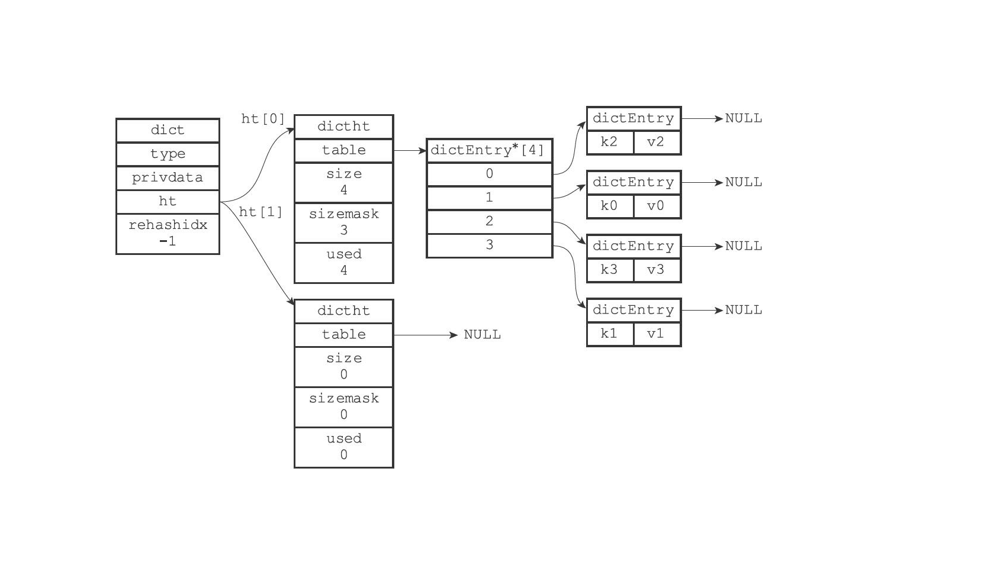

# redis总结

## redis的特性
1. 单线程，避免线程切换和锁操作
2. 高性能，单机并发量达到万级
3. 支持集群模式

## redis单线程高性能的原因
1. 纯内存访问，内存的响应时间是100ns，redis并发达到每秒w级
2. 非阻塞io，redis使用epoll作为多路复用的实现，redis基于epoll实现了自己的事件处理模型。将epoll中的连接、读写、关闭都转换为事件，不在网络I/O上浪费过多的时间。
3. 单线程避免了锁竞争和线程切换，以及线程创建。
4. 单线程有利于高性能数据结构的实现。

## redis单线程的问题
对于每个命令都是有执行时间的，如果某个命令执行时间过长，会造成其它命令阻塞，对高性能来说是致命的。

## redis应用场景
1. 消息队列系统，利用redis的发布订阅和阻塞功能
2. 分布式锁，利用setnx或者lua脚本实现原子操作
3. 缓存，分布式缓存，提高系统的响应速度
4. 排行榜系统，使用redis的列表和有序集合
5. 计数器应用

## redis不适合的场景
1. 从数据规模，过大的数据不适合放在redis中
2. 从数据类型，分为冷数据和热数据（频繁操作的），reids存冷数据有些浪费资源


## redis的基本数据类型
### 1. string类型
数据结构：自定义SDS，不是c语言字符串
```c++
struct sdshdr {
//记录buf数组中已使⽤字节的数量
//等于SDS所保存字符串的⻓度
int len;
//记录buf
数组中未使⽤字节的数量
int free;
//字节数组， ⽤于保存字符串
char buf[];
}
```
**和c字符串相比优缺点如下：**
c字符串 | SDS字符串 | 
---------|----------|
 获取长度复杂度O(N) | 获取长度复杂度O(N)  |
 API不安全，缓冲区可能溢出| API安全，缓冲区不会溢出 | 
 修改字符串N次内存分配N次 | 内存分配次数最多为N次 | 
 只能保持文本书籍 | 可以保存文本和二进制数据 |
 可以使用所有<string.h>库函数|可以使用部分<string.h>库函数| 

### SDS内存分配
如果对SDS进⾏修改之后， SDS的长度（也即是len属性的值） 将小于1MB， 那么程序分配和len属性同样⼤小的未使用空间， 这时SDS len属性的值将和free属性的值相同，大于1M直接分配1M的未使用空间。
在扩展SDS空间之前， SDS API会先检查未使⽤空间是否⾜够， 如果⾜够的话， API就会直接使⽤未使⽤空间， ⽽⽆须执⾏内存重分配。
用途：1.字符串存储，数字，二进制数据也可以，大小（512m以内）

惰性空间释放⽤于优化SDS的字符串缩短操作： 当SDS的API需要缩短SDS保存的字符串时，
程序并不⽴即使⽤内存重分配来回收缩短后多出来的字节， ⽽是使⽤free属性将这些字节的数量
记录起来， 并等待将来使⽤

### 2. 字典（hash表）
数据结构：hash表，hash节点，字典（Redis使⽤MurmurHash2算法来计算键的哈希值。）
```c++
typedef struct dict {
    //类型特定函数
    dictType *type;
    //私有数据
    void *privdata;
    //哈希表
    dictht ht[2];
    // rehash索引
    //当rehash不在进⾏时， 值为-1
    in trehashidx; 
} dict;


typedef struct dictht {
    //哈希表数组
    dictEntry **table;
    //哈希表⼤⼩
    unsigned long size;
    //哈希表⼤⼩掩码， ⽤于计算索引值
    //总是等于size-1
    unsigned long sizemask;
    //该哈希表已有节点的数量
    unsigned long used;
} dictht;

typedef struct dictEntry {
    //键
    void *key;
    //值
    union{
        void *val;
        uint64_tu64;
        int64_ts64;
} v;
//指向下个哈希表节点， 形成链表
struct dictEntry *next;
} dictEntry;
```
### redis如何解决hash表问题
**1、redis如何计算hashcode**
```
Redis使⽤MurmurHash2算法来计算键的哈希值。
```
**2、如何解决hash冲突**
```
Redis的哈希表使⽤链地址法（separate chaining） 来解决键冲突， 每个哈希表节点都有⼀个next指针，多个哈希表节点可以⽤next指针构成⼀个单向链表，被分配到同⼀个索引上的多个节
点可以⽤这个单向链表连接起来，这就解决了键冲突的问题。
```
**3、rehash**

* 1） 为字典的ht[1]哈希表分配空间， 这个哈希表的空间⼤⼩取决于要执⾏的操作， 以及ht[0]当前包含的键值对数量（也即是ht[0].used属性的值） ：
    * ·如果执⾏的是扩展操作， 那么ht[1]的⼤小为第⼀个⼤于等于ht[0].used*2的2 n（2的n次⽅幂） ；
    * ·如果执⾏的是收缩操作， 那么ht[1]的⼤小为第⼀个⼤于等于ht[0].used的2 n。
* 2） 将保存在ht[0]中的所有键值对rehash到ht[1]上⾯：rehash指的是重新计算键的哈希值和索引值， 然后将键值对放置到ht[1]哈希表的指定位置上。
* 3） 当ht[0]包含的所有键值对都迁移到了ht[1]之后（ht[0]变为空表） ， 释放ht[0]， 将ht[1]设置为ht[0]， 并在ht[1]新创建⼀个空⽩哈希表， 为下⼀次rehash做准备。
**4、渐进式rehash**
因为在进⾏渐进式rehash的过程中，字典会同时使⽤ht[0]和ht[1]两个哈希表，所以在渐进式rehash进⾏期间，字典的删除（delete）、查找（find）、更新（update）等操作会在两个哈希表上进⾏。例如，要在字典⾥⾯查找⼀个键的话，程序会先在ht[0]⾥⾯进⾏查找， 如果没找到的话，就会继续到ht[1]⾥⾯进⾏查找，诸如此类。
另外，在渐进式rehash执⾏期间，新添加到字典的键值对⼀律会被保存到ht[1]⾥⾯， ⽽ht[0]则不再进⾏任何添加操作， 这⼀措施保证了ht[0]包含的键值对数量会只减不增， 并随着rehash操
作的执⾏⽽最终变成空表。

### 3. list
数据结构：自定义的双向链表，listNode，list
```c++
typedef struct listNode {
//前置节点
struct listNode * prev;
//后置节点
struct listNode * next;
//节点的值
void * value;
}listNode;

typedef struct list {
//表头节点
listNode * head;
//表尾节点
listNode * tail;
//链表所包含的节点数量
unsigned long len;
//节点值复制函数
void *(*dup)(void *ptr);
//节点值释放函数
void (*free)(void *ptr);
//节点值对⽐函数
int (*match)(void *ptr,void *key);} list
```
* ·链表被⼴泛用于实现Redis的各种功能， 比如列表键、 发布与订阅、 慢查询、 监视器等。
* ·每个链表节点由⼀个listNode结构来表示， 每个节点都有⼀个指向前置节点和后置节点的指针， 所以Redis的链表实现是双端链表。
* ·每个链表使用⼀个list结构来表示， 这个结构带有表头节点指针、 表尾节点指针， 以及链表长度等信息。
* ·因为链表表头节点的前置节点和表尾节点的后置节点都指向NULL， 所以Redis的链表实现是⽆环链表。
* ·通过为链表设置不同的类型特定函数， Redis的链表可以用于保存各种不同类型的值。

### 4. set
数据结构：set

特性：元素是无序的，元素不可以重复

用途：

### 5. sortedset
数据结构：ziplist，skiplist，intset

特性：元素是有序的，元素不可以重复

用途：

## redis事务处理
1. watch


## redis持久化策略
### 1. rdb
定时刷新内存，进行持久化。可以手动触发命令

### 2. aof，实时持久化，性能会降低一些。
aof持久化功能实现上分为追加，文件写入，文件同步三个步骤

## redis使用lua脚本的优势？


## redis的多路复用机制


## 快照的实现原理


## redis内存优化策略


## redis的集群模式
### 1. master-slave
主从复制的原理：

### 2. master-slave-sentinel
哨兵的原理：

### 3. redis-cluster
redis集群的原理：

增加节点：

删除节点：

## 其它集群方案
redis shardding

codis

twemproxy


> 参考《redis开发与运维》，《redis设计与实现》，两本书。
