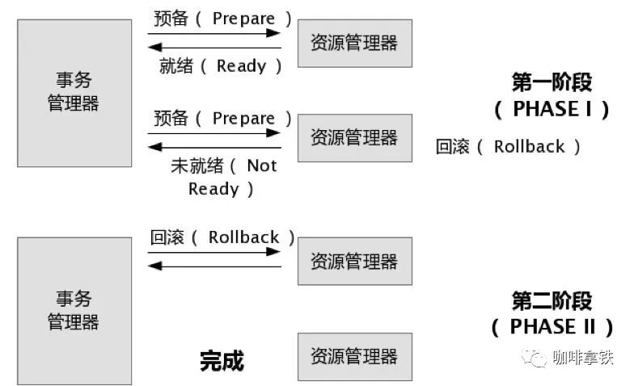

## 什么是事务？
事务提供一种机制将一个活动涉及的所有操作纳入到一个不可分割的执行单元，组成事务的所有操作只有在所有操作均能正常执行的情况下方能提交，只要其中任一操作执行失败，都将导致整个事务的回滚。简单地说，事务提供一种“要么什么都不做，要么做全套（All or Nothing）”机制。

## 单机事务的特性
1. 原子性：原子性是指事务的操作都是原子的，操作要么全部成功，要么失败全部回滚；
2. 一致性：一致性是指事务必须使数据库从一个一致性状态变换到另一个一致性状态，也就是说一个事务执行之前和执行之后都必须处于一致性状态；
3. 隔离性：隔离性是指事务的操作之间是相互隔离的，互不干扰，多个事务并发执行时，就感觉像单一事务执行一样，达到预期结果；
4. 持久性：持久性是指一个事务一旦被提交了，那么对数据库中的数据的改变就是永久性的，即便是在数据库系统遇到故障的情况下也不会丢失提交事务的操作；

## 什么是分布式事务？
分布式事务就是指事务的参与者、支持事务的服务器、资源服务器以及事务管理器分别位于不同的分布式系统的不同节点之上。简单的说，就是一次大的操作由不同的小操作组成，这些小的操作分布在不同的服务器上，且属于不同的应用，分布式事务需要保证这些小操作要么全部成功，要么全部失败。本质上来说，分布式事务就是为了保证不同数据库的数据一致性。

## 分布式事务的解决方案？
1、二阶段提交
2、三阶段提交

## 二阶段提交
### 二阶段提交的原理

2pc两个阶段是指：第一阶段：准备阶段(投票阶段)和第二阶段：提交阶段（执行阶段）

**1、准备阶段**

事务协调者(事务管理器)给每个参与者(资源管理器)发送Prepare消息，每个参与者要么直接返回失败(如权限验证失败)，要么在本地执行事务，写本地的redo和undo日志，但不提交，到达一种“万事俱备，只欠东风”的状态。
可以进一步将准备阶段分为以下三个步骤：

* 1）协调者节点向所有参与者节点询问是否可以执行提交操作(vote)，并开始等待各参与者节点的响应。

* 2）参与者节点执行询问发起为止的所有事务操作，并将Undo信息和Redo信息写入日志。（注意：若成功这里其实每个参与者已经执行了事务操作）

* 3）各参与者节点响应协调者节点发起的询问。如果参与者节点的事务操作实际执行成功，则它返回一个”同意”消息；如果参与者节点的事务操作实际执行失败，则它返回一个”中止”消息。

**2、提交阶段**
如果协调者收到了参与者的失败消息或者超时，直接给每个参与者发送回滚(Rollback)消息；否则，发送提交(Commit)消息；参与者根据协调者的指令执行提交或者回滚操作，释放所有事务处理过程中使用的锁资源。(注意:必须在最后阶段释放锁资源)

接下来分两种情况分别讨论提交阶段的过程。

1. 当协调者节点从所有参与者节点获得的相应消息都为”同意”时:
    * 1）协调者节点向所有参与者节点发出”正式提交(commit)”的请求。

    * 2）参与者节点正式完成操作，并释放在整个事务期间内占用的资源。

    * 3）参与者节点向协调者节点发送”完成”消息。

    * 4）协调者节点受到所有参与者节点反馈的”完成”消息后，完成事务。
2. 如果任一参与者节点在第一阶段返回的响应消息为”中止”，或者 协调者节点在第一阶段的询问超时之前无法获取所有参与者节点的响应消息时
    * 1）协调者节点向所有参与者节点发出”回滚操作(rollback)”的请求。

    * 2）参与者节点利用之前写入的Undo信息执行回滚，并释放在整个事务期间内占用的资源。

    * 3）参与者节点向协调者节点发送”回滚完成”消息。

    * 4）协调者节点受到所有参与者节点反馈的”回滚完成”消息后，取消事务。

### 二阶段提交的问题

1、同步阻塞问题。执行过程中，所有参与节点都是事务阻塞型的。当参与者占有公共资源时，其他第三方节点访问公共资源不得不处于阻塞状态。

2、单点故障。由于协调者的重要性，一旦协调者发生故障。参与者会一直阻塞下去。尤其在第二阶段，协调者发生故障，那么所有的参与者还都处于锁定事务资源的状态中，而无法继续完成事务操作。（如果是协调者挂掉，可以重新选举一个协调者，但是无法解决因为协调者宕机导致的参与者处于阻塞状态的问题）

3、数据不一致。在二阶段提交的阶段二中，当协调者向参与者发送commit请求之后，发生了局部网络异常或者在发送commit请求过程中协调者发生了故障，这回导致只有一部分参与者接受到了commit请求。而在这部分参与者接到commit请求之后就会执行commit操作。但是其他部分未接到commit请求的机器则无法执行事务提交。于是整个分布式系统便出现了数据部一致性的现象。

4、二阶段无法解决的问题：协调者再发出commit消息之后宕机，而唯一接收到这条消息的参与者同时也宕机了。那么即使协调者通过选举协议产生了新的协调者，这条事务的状态也是不确定的，没人知道事务是否被已经提交。

## 三阶段提交

## 最终一致性

