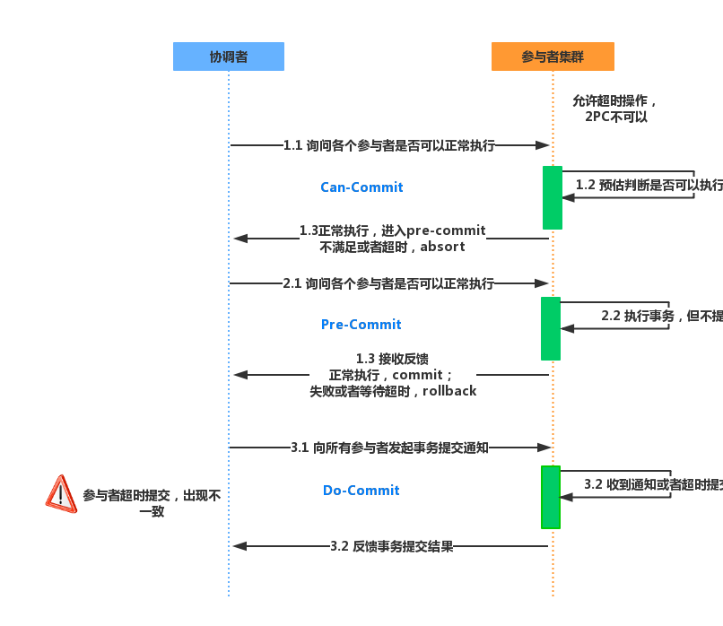

## 什么是事务？
事务提供一种机制将一个活动涉及的所有操作纳入到一个不可分割的执行单元，组成事务的所有操作只有在所有操作均能正常执行的情况下方能提交，只要其中任一操作执行失败，都将导致整个事务的回滚。简单地说，事务提供一种“要么什么都不做，要么做全套（All or Nothing）”机制。

## 单机事务的特性
1. 原子性：原子性是指事务的操作都是原子的，操作要么全部成功，要么失败全部回滚；
2. 一致性：一致性是指事务必须使数据库从一个一致性状态变换到另一个一致性状态，也就是说一个事务执行之前和执行之后都必须处于一致性状态；
3. 隔离性：隔离性是指事务的操作之间是相互隔离的，互不干扰，多个事务并发执行时，就感觉像单一事务执行一样，达到预期结果；
4. 持久性：持久性是指一个事务一旦被提交了，那么对数据库中的数据的改变就是永久性的，即便是在数据库系统遇到故障的情况下也不会丢失提交事务的操作；

## 什么是分布式事务？
分布式事务就是指事务的参与者、支持事务的服务器、资源服务器以及事务管理器分别位于不同的分布式系统的不同节点之上。简单的说，就是一次大的操作由不同的小操作组成，这些小的操作分布在不同的服务器上，且属于不同的应用，分布式事务需要保证这些小操作要么全部成功，要么全部失败。本质上来说，分布式事务就是为了保证不同数据库的数据一致性。

## 分布式事务的解决方案？
1、二阶段提交
2、三阶段提交

## 二阶段提交
### 二阶段提交的原理

2pc两个阶段是指：第一阶段：准备阶段(投票阶段)和第二阶段：提交阶段（执行阶段）

**1、准备阶段**

事务协调者(事务管理器)给每个参与者(资源管理器)发送Prepare消息，每个参与者要么直接返回失败(如权限验证失败)，要么在本地执行事务，写本地的redo和undo日志，但不提交，到达一种“万事俱备，只欠东风”的状态。
可以进一步将准备阶段分为以下三个步骤：

* 1）协调者节点向所有参与者节点询问是否可以执行提交操作(vote)，并开始等待各参与者节点的响应。

* 2）参与者节点执行询问发起为止的所有事务操作，并将Undo信息和Redo信息写入日志。（注意：若成功这里其实每个参与者已经执行了事务操作）

* 3）各参与者节点响应协调者节点发起的询问。如果参与者节点的事务操作实际执行成功，则它返回一个”同意”消息；如果参与者节点的事务操作实际执行失败，则它返回一个”中止”消息。

**2、提交阶段**
如果协调者收到了参与者的失败消息或者超时，直接给每个参与者发送回滚(Rollback)消息；否则，发送提交(Commit)消息；参与者根据协调者的指令执行提交或者回滚操作，释放所有事务处理过程中使用的锁资源。(注意:必须在最后阶段释放锁资源)

接下来分两种情况分别讨论提交阶段的过程。

1. 当协调者节点从所有参与者节点获得的相应消息都为”同意”时:
    * 1）协调者节点向所有参与者节点发出”正式提交(commit)”的请求。

    * 2）参与者节点正式完成操作，并释放在整个事务期间内占用的资源。

    * 3）参与者节点向协调者节点发送”完成”消息。

    * 4）协调者节点受到所有参与者节点反馈的”完成”消息后，完成事务。
2. 如果任一参与者节点在第一阶段返回的响应消息为”中止”，或者 协调者节点在第一阶段的询问超时之前无法获取所有参与者节点的响应消息时
    * 1）协调者节点向所有参与者节点发出”回滚操作(rollback)”的请求。

    * 2）参与者节点利用之前写入的Undo信息执行回滚，并释放在整个事务期间内占用的资源。

    * 3）参与者节点向协调者节点发送”回滚完成”消息。

    * 4）协调者节点受到所有参与者节点反馈的”回滚完成”消息后，取消事务。

### 二阶段提交的问题

1、同步阻塞问题。执行过程中，所有参与节点都是事务阻塞型的。当参与者占有公共资源时，其他第三方节点访问公共资源不得不处于阻塞状态。

2、单点故障。由于协调者的重要性，一旦协调者发生故障。参与者会一直阻塞下去。尤其在第二阶段，协调者发生故障，那么所有的参与者还都处于锁定事务资源的状态中，而无法继续完成事务操作。（如果是协调者挂掉，可以重新选举一个协调者，但是无法解决因为协调者宕机导致的参与者处于阻塞状态的问题）

3、数据不一致。在二阶段提交的阶段二中，当协调者向参与者发送commit请求之后，发生了局部网络异常或者在发送commit请求过程中协调者发生了故障，这回导致只有一部分参与者接受到了commit请求。而在这部分参与者接到commit请求之后就会执行commit操作。但是其他部分未接到commit请求的机器则无法执行事务提交。于是整个分布式系统便出现了数据部一致性的现象。

4、二阶段无法解决的问题：协调者再发出commit消息之后宕机，而唯一接收到这条消息的参与者同时也宕机了。那么即使协调者通过选举协议产生了新的协调者，这条事务的状态也是不确定的，没人知道事务是否被已经提交。

## 三阶段提交

1) CanCommit阶段
协调者向参与者发送commit请求，参与者如果可以提交就返回Yes响应，否则返回No响应。

2) PreCommit阶段
Coordinator根据Cohort的反应情况来决定是否可以继续事务的PreCommit操作。
A.假如Coordinator从所有的Cohort获得的反馈都是Yes响应，那么就会进行事务的预执行：
发送预提交请求。Coordinator向Cohort发送PreCommit请求，并进入Prepared阶段。
事务预提交。Cohort接收到PreCommit请求后，会执行事务操作，并将undo和redo信息记录到事务日志中。
响应反馈。如果Cohort成功的执行了事务操作，则返回ACK响应，同时开始等待最终指令。

B.假如有任何一个Cohort向Coordinator发送了No响应，或者等待超时之后，
Coordinator都没有接到Cohort的响应，那么就中断事务

3) DoCommit阶段，该阶段进行真正的事务提交。

与两阶段提交不同的是，三阶段提交有两个改动点。
1、引入超时机制。同时在协调者和参与者中都引入超时机制。
2、在第一阶段和第二阶段中插入一个准备阶段。保证了在最后提交阶段之前各参与节点的状态是一致的。

相对于2PC，3PC主要解决的单点故障问题，并减少阻塞，因为一旦参与者无法及时收到来自协调者的信息之后，他会默认执行commit，而不会一直持有事务资源并处于阻塞状态。但是这种机制也会导致数据一致性问题，因为，由于网络原因，协调者发送的abort响应没有及时被参与者接收到，那么参与者在等待超时之后执行了commit操作。这样就和其他接到abort命令并执行回滚的参与者之间存在数据不一致的情况。

## 最终一致性
1. 最大努力通知型（定期校对模型，非可靠消息模型）
2. 异步确保型
3. TCC（两阶段型，补偿型）
### 1、定期校对模型

#### 实现方式：
1.主动业务方在业务处理完成后，同步消息的方式将结果发送给业务被动方，消息可能存在丢失的情况；
2.被动业务方在获取了主动业务方的消息后，推进业务；
3.被动业务方定时查询主动业务方处理结果，恢复由于消息丢失导致的无法推进的业务；
#### 约束条件：
被动业务方的处理结果不影响主动业务方处理结果；
构建成本：需要构建定期校对模块，补偿业务；
#### 适用范围：
1.对业务最终一致性时间敏感度较低的业务；
2.较为适合跨企业的业务活动；
3.较为适合非可靠消息或消息存在丢失的业务活动；
#### 使用业务场景：
1. 跨企业业务活动，数据报表对账；如：支付宝与银行交易对账；
2. 下层系统通过异步化回执上层系统的架构中，上层系统通过定期校对进行数据恢复；如：上层系统充值订单，下层充值支付系统，在支付系统异步反馈充值结果的场景

### 2、非可靠消息模型

#### 实现方式：
1. 业务活动主动方，通过业务活动本地事务，记录消息信息到业务活动本地数据库中；
2. 业务活动处理完成后，通过非可靠消息系统将消息发送给业务的被动方(注意：消息存在丢失)；
3. 消息校对服务定期查询被动方服务处理结果，并将未处理成功的消息重新投递给消息系统进行补发送；
4. 业务活动被动方获取消息后，处理业务；
#### 约束条件：
1. 被动业务方的处理结果不影响主动业务方处理结果；
2. 被动方消息处理需要支持幂等；
3. 查询业务把业务主动方与被动方耦合在一起；
##### 构建成本：
1. 定期校对系统；
2. 消息恢复系统
#### 适用范围：
1. 对最终一致性实时性要求不高的场景；
2. 降低业务处理的复杂度，可以将一个业务拆分为两个，并保证最终一致的模型；

### 3、可靠消息模型

实现方式：
1. 业务活动主动方，通过业务活动本地事务，记录消息信息到业务活动本地数据库中，保证操作业务数据与消息表信息在本地事务一致；
2. 业务活动处理完成后，通过可靠消息系统将消息发送给业务的被动方；
3. 在消息发送完成后，删除业务活动本地数据库中的消息信息；
4. 消息恢复系统定期找到未成功发送的消息，交给实时消息服务补发送；
5. 业务活动被动方获取消息后，处理业务

约束条件：
1. 被动业务方的处理结果不影响主动业务方处理结果；
2. 被动方消息处理需要支持幂等；

构建成本：
1. 可靠消息系统(即：消息投递到消息中间件后，不能丢失且消息必须送达消费者)；
2. 消息恢复系统；

适用范围：
1. 对最终一致性实时性要求较高的场景；
2. 降低业务被动方的实现成本；

### 4、TCC模型

实现方式：
1.一个业务活动有一个主业务活动与若干个从业务活动组成；
2.主业务活动负责发起整个业务活动，承担部分协调者的角色；
3.从业务活动负责提供TCC操作；
4.业务活动管理器负责控制业务活动的一致性，它记录业务活动操作，并在业务活动提交时
确认所有的TCC型操作的confirm操作，在业务活动取消时调用所有TCC型操作的cancel操作，
如果调用提交或取消接口失败，需要支持定期重试，事务达到最终一致的状态；

构建成本：
1.业务被动方需要实现TCC操作；
2.业务活动结束时，活动管理器需要调用confirm或cancel操作的成本；
3.业务活动操作日志记录的成本；

适用场景：
1.强隔离性，强一致性要求的业务活动；
2.适用于执行时间较短的业务活动；

#### TCC中两阶段提交的角色如何划分？
1、协调者：
在TCC模型中，协调者由两个组件担任：
* a) 主业务活动：主要负责发起业务活动，登记业务操作，只参与业务一阶段，业务活动的最终状态就是分布式事务的最终状态；
* b) 业务活动管理器：负责记录活动日志，推进业务活动，在业务处理出现超时后进行补偿操作，保证分布式事务达到一致的状态；

2、参与者：
* a) 负责提供准备，提交，取消方法，等待主业务活动或业务活动管理器的调用；
* b) 由于业务活动管理器在出现超时后，为了保证分布式事务一致性会发起重试，所以提交/取消操作接口需要支持幂等；

#### TCC模型是如何解决两阶段提交的问题？
1. 协调者单点问题：将协调者由单点，变为多点，抽象为集群
2. 同步阻塞：引入超时机制，超时后进行补偿处理
3. 数据一致性问题：引入补偿后，不会出现阻塞，数据会在一定时间后得到一致

