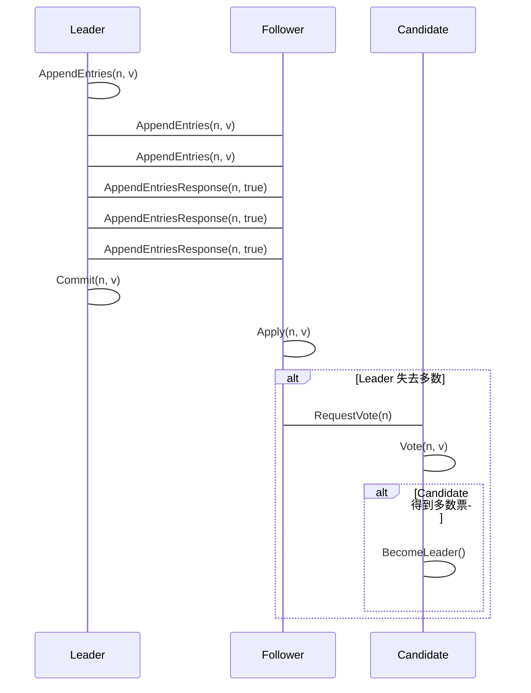

## 1、什么是raft协议

Paxos算法可能不少人都听说过，几乎垄断了一致性算法领域，在Raft协议诞生之前，Paxos几乎成了一致性协议的代名词。但是对于大多数人来说，Paxos算法太难以理解了，而且难以实现。因此斯坦福大学的两位教授Diego Ongaro和John Ousterhout决定设计一种更容易理解的一致性算法，最终在论文"In search of an Understandable Consensus Algorithm"中提出了Raft算法。

## 2、raft协议原理

为了让一致性协议变得简单可理解，Raft协议主要使用了两种策略。

一是将复杂问题进行分解，在Raft协议中，一致性问题被分解为：`leader election`、`log replication`、`safety`三个简单问题；

二是减少状态空间中的状态数目。下面我们详细看一下Raft协议是怎样设计的。

在Raft体系中，有一个强leader，由它全权负责接收客户端的请求命令，并将命令作为日志条目复制给其他服务器，在确认安全的时候，将日志命令提交执行。当leader故障时，会选举产生一个新的leader。在强leader的帮助下，Raft将一致性问题分解为了三个子问题：

1. leader选举：当已有的leader故障时必须选出一个新的leader。
2. 日志复制：leader接受来自客户端的命令，记录为日志，并复制给集群中的其他服务器，并强制其他节点的日志与leader保持一致。
3. 安全safety措施：通过一些措施确保系统的安全性，如确保所有状态机按照相同顺序执行相同命令的措施。

## 3、raft协议详解

服务器可能会处于如下三种角色：leader、candidate（候选）、follower，正常运行的情况下，会有一个leader，其他全为follower，follower只会响应leader和candidate的请求，而客户端的请求则全部由leader处理，即使有客户端请求了一个follower也会将请求重定向到leader。candidate代表候选人，出现在选举leader阶段，选举成功后candidate将会成为新的leader。

## 4、raft协议在框架中的应用有哪些？

redis缓存

etcd

> **参考文章:**
>
> 1. https://docs.qq.com/doc/DY0VxSkVGWHFYSlZJ?_t=1611388585523
> 2. https://github.com/LLHFWT/rache
> 3. https://zhuanlan.zhihu.com/p/91288179
> 4. https://zhuanlan.zhihu.com/p/343234080

