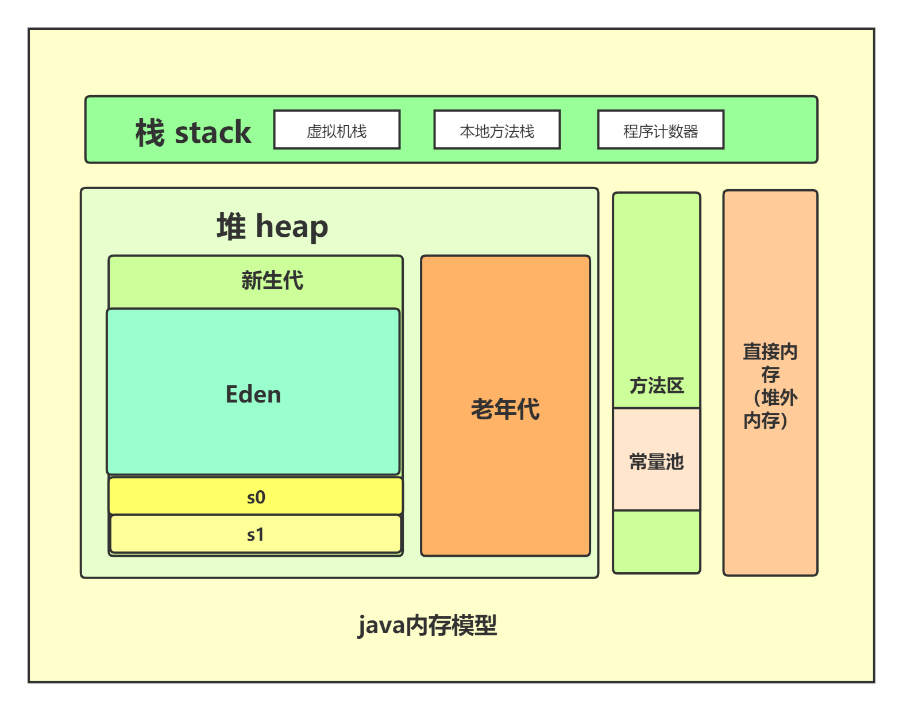
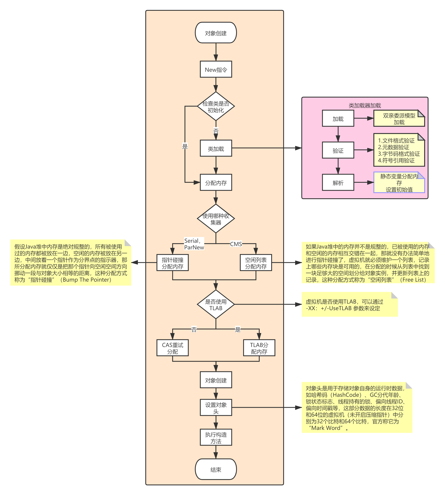

# java虚拟机知识
## java内存模型

### 1、程序计数器
一块较小的内存空间，它可以看作是当前线程所执行的字节码的行号指示器,字节码解释器工作时就是通过改变这个计数器的值来选取下一条需要执行的字节码指令，分 支、循环、跳转、异常处理、线程恢复等基础功能都需要依赖这个计数器来完成,没有oom溢出

### 2、Java虚拟机栈
线程私有的，它的生命周期与 线程相同。虚拟机栈描述的是Java方法执行的内存模型：每个方法在执行的同时都会创建一个栈帧 （Stack Frame [1] ）用于存储局部变量表、操作数栈、动态链接、方法出口等信息

如果线程请求的栈深度大于虚拟机所允许 的深度，将抛出StackOverflowError异常；如果虚拟机栈可以动态扩展（当前大部分的Java虚拟机都可动 态扩展，只不过Java虚拟机规范中也允许固定长度的虚拟机栈），如果扩展时无法申请到足够的内存， 就会抛出OutOfMemoryError异常。

### 3、本地方法栈
本地方法栈则为虚拟机使用到的Native方法服务，本地方法栈区域也会抛出StackOverflowError和OutOfMemoryError异常

### 4、java堆
分为新生代,老年代和永久代，新生代再细分Eden，From survivor，To Survivor

### 5、方法区
方法区（Method Area）与Java堆一样，是各个线程共享的内存区域，它用于存储已被虚拟机加载的 类信息、常量、静态变量、即时编译器编译后的代码等数据。

## 对象组成
在HotSpot虚拟机里，对象在堆内存中的存储布局可以划分为三个部分：对象头（Header）、实例数据（Instance Data）和对齐填充（Padding）。

对象的第一部分：Mark Word
第一类是用于存储对象自身的运行时数据，如哈希码（HashCode）、GC分代年龄、锁状态标志、线程持有的锁、偏向线程ID、偏向时间戳等，这部分数据的长度在32位和64位的虚拟机（未开启压缩指针）中分别为32个比特和64个比特。

Mark Word的32个比特存储空间中的25个比特用于存储对象哈希码，4个比特用于存储对象分代年龄，2个比特用于存储锁标志位，1个比特固定为0，在其他状态（轻量级锁定、重量级锁定、GC标记、可偏向）

对象头的另外一部分是类型指针，即对象指向它的类型元数据的指针，Java虚拟机通过这个指针来确定该对象是哪个类的实例。

对象的第二部分是实例数据部分，是对象真正存储的有效信息，即我们在程序代码里面所定义的各种类型的字段内容，无论是从父类继承下来的，还是在子类中定义的字段都必须记录起来

对象的第三部分是对齐填充，这并不是必然存在的，也没有特别的含义，它仅仅起着占位符的作用。

## java的内存溢出类型
* 堆内存溢出
* 虚拟机栈内存和本地方法栈溢出
* 方法区和常量池溢出
* 本机直接内存溢出（堆外内存）

## jvm垃圾回收器
* Serial收集器，新生代收集器，只会使用一个CPU或一条收集线程去完成垃圾收集工作，更重要的是在它进行垃圾收集时，必须 暂停其他所有的工作线程，直到它收集结束
* ParNew收集器，新生代收集器，其实就是Serial收集器的多线程版本,
* Parallel Scavenge,新生代收集器,收集器的目标则是达到一个可控制的吞吐量
* Serial Old是Serial收集器的老年代版本，是一个单线程收集器，使用“标记-整理”算法
* Parallel Old是Parallel Scavenge收集器的老年代版本，使用多线程和“标记-整理”算法
* cms收集器是基于“标记—清除”算法实现的
  * 
* G1，分代收集，G1从整体来看是基于“标记—整理”算法实现的收集 器，从局部（两个Region之间）上来看是基于“复制”算法实现的
  * 
* ZGC，分代收集，

### 垃圾回收器详细对比

| 垃圾回收器        | 回收对象 | 并行和并发 | 算法            | stw阶段 |
| :---------------- | -------- | ---------- | --------------- | ------- |
| Serial            | 新生代   | 单线程     | 复制            |         |
| ParNew            | 新生代   | 多线程     | 复制            |         |
| Parallel Scavenge | 新生代   | 多线程     | 复制            |         |
| Serial Old        | 老年代   | 单线程     | 标记-整理       |         |
| Parallel Old      | 老年代   | 多线程     | 标记-整理       |         |
| CMS               | 老年代   | 多线程     | 复制，标记-清除 |         |
| G1                | 分代收集 | 多线程     | 复制，标记-整理 |         |
| ZGC               | 全部收集 | 多线程     | 复制，标记-清除 |         |

### 垃圾回收器组合
1. Serial+Serial Old
2. ParNew+CMS
3. Parallel Scavenge+Parallel Old
4. G1

## jvm垃圾回收分类
1. 新生代
2. 老年代

## jvm垃圾回收算法
* 复制算法，效率高，但是空间利用不足，主要是新生代垃圾回收使用
* 标记整理，不会产生空间碎片
* 标记清除，产生大量空间碎片，不利于大对象的内存分配，主要用于老年代使用。

## java对象内存分配规则
1. 对象优先再Eden区进行分配，Eden区不够发起一次MinorGC。
2. 大对象优先在老年代分配，避免在Eden区以及S0，S1来回复制。
3. 长期存活的对象会进入老年代，默认年龄为15，可以通过`-XX：MaxTenuringThreshold=5`设置gc年龄。
4. 如果在Survivor空间中相同年龄所有对象大小的总和大于Survivor空间的一半，年龄大于或等于该年龄的对象就可以直接进入老年代。
5. 只要老年代的连续空间大于新生代对象总大小或者历次晋升的平均大小，就会进行Minor GC，否则将进行Full GC。

## java对象创建流程

## 类加载
### 1、类加载的时机
对于初始化阶段，《Java虚拟机规范》则是严格规定了有且只有六种情况必须立即对类进行“初始化”
1. 遇到new、getstatic、putstatic或invokestatic这四条字节码指令时
   1. 使用new关键字实例化对象的时候
   2. 读取或设置一个类型的静态字段
   3. 调用一个类型的静态方法的时候
2. 使用java.lang.reflect包的方法对类型进行反射调用的时候
3. 当初始化类的时候，如果发现其父类还没有进行过初始化
4. 当虚拟机启动时，用户需要指定一个要执行的主类
5. 如果一个java.lang.invoke.MethodHandle实例最后的解析结果为REF_getStatic、REF_putStatic、REF_invokeStatic、REF_newInvokeSpecial四种类型的方法句柄。且这个方法句柄对应的类没有进行过初始化
6. 当一个接口中定义了JDK 8新加入的默认方法（被default关键字修饰的接口方法）时，如果有这个接口的实现类发生了初始化

## jvm如何判断对象引用
1. 根据引用计数
2. 根据GCRoot链，查找引用

## jvm参数
-Xms 堆内存最小值
-Xmx 堆内存最大值
-Xss 线程内存
-XX:PermSize 永久代内存
-XX:MaxPermSize 永久代内存
-XX:MaxDirectMemorySize   直接内存
-XX:+HeapDumpOnOutOfMemoryError，可以让虚拟机在OOM异常出现之后自动生成dump文件
-XX:+HeapDumpOnCtrlBreak 可以使用[Ctrl]+[Break]键让虚拟机生成dump文件
-XX:+PrintGCTimeStamps 打印GC停顿时间
-XX:+PrintGCDetails 打印GC详细信息
-verbose:gc 打印GC信息，输出内容已被前一个参数包括
-Xloggc:gc.log

-XX:+UseConcMarkSweepGC
-XX:+UseParNewGC 要求虚拟机在新生代和老年代分别使用ParNew和CMS收集器进行垃圾回收

-XX:+UseSpinning开启自旋锁
-XX:PreBlockSpin自旋锁自旋的次数

## jvm线上问题分析工具
1. cpu出现100%如何定位？
2. 内存溢出如何定位？
3. 线程死锁如何定位？

### jdk自带的工具
* jps 可以列出正在运行的虚拟机进程，并显示虚拟机执行主类名称
* jstat 它可以显示本地或者远程 [1] 虚拟机进程中的类装载、内存、垃圾收集、JIT编译等运行数据
* jinfo 实时地查看和调整虚拟机各项参数
* jmap 用于生成堆转储快照
* jhat 与jmap搭配使用，来分析jmap生成的堆转储快 照
* jstack 用于生成虚拟机当前时刻的线程快照,生成线程快照的主 要目的是定位线程出现长时间停顿的原因，如线程间死锁、死循环、请求外部资源导致的长时间等待等 都是导致线程长时间停顿的常见原因
* JConsole 可以对jvm进行内存监控，线程监控
* Visual VM
  * 显示虚拟机进程以及进程的配置、环境信息（jps、jinfo）。
  * 监视应用程序的CPU、GC、堆、方法区以及线程的信息（jstat、jstack）。
  * dump以及分析堆转储快照（jmap、jhat）。
  * 方法级的程序运行性能分析，找出被调用最多、运行时间最长的方法。
  * 离线程序快照

## jvm类加载机制
双亲委派模型

> 参考《深入理解jvm虚拟机第二版》，《java虚拟机规范》。

