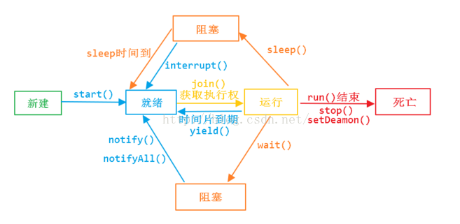

# java多线程
## 线程和进程
1. 概念
    * 进程是具有一定独立功能的程序关于某个数据集合上的一次运行活动,进程是系统进行资源分配和调度的一个独立单位。
    * 线程是进程的一个实体,是CPU调度和分派的基本单位,它是比进程更小的能独立运行的基本单位.

2. 区别
    1) 一个程序至少有一个进程,一个进程至少有一个线程.
    2) 线程的划分尺度小于进程，线程必进程更轻量级，使得多线程程序的并发性高。
    3) 进程在执行过程中拥有独立的内存单元，而多个线程共享内存，从而极大地提高了程序的运行效率。
    4) 线程在执行过程中与进程还是有区别的。每个独立的线程有一个程序运行的入口、顺序执行序列和程序的出口。但是线程不能够独立执行，必须依存在应用程序中，由应用程序提供多个线程执行控制。
    5) 从逻辑角度来看，多线程的意义在于一个应用程序中，有多个执行部分可以同时执行。但操作系统并没有将多个线程看做多个独立的应用，来实现进程的调度和管理以及资源分配。这就是进程和线程的重要区别。

## 线程和协程的区别
1. 协程是单线程，多个协程在一个线程里调度
2. 协程由应用层调度，不需要cpu内核调度
3. 协程内存暂用更少，一个协程只需要几十k，而线程需要8m或者更多


## 什么时候使用多线程？什么时候使用单线程？
单线程性能并不一定低，单线程没有锁和线程切换，资源占用少。
当线程切换和创建的时间原因小于代码执行时间时，多线程能发挥大作用。


## java多线程的缺点？
1. 代码复杂
2. 加锁操作严重影响性能

## 线程的实现方式？java线程是如何实现的？
实现线程主要有3种方式：使用内核线程实现、使用用户线程实现、使用用户线程加轻量级进程混合实现。

### 1、内核线程实现
内核线程（Kernel-Level Thread,KLT）就是直接由操作系统内核（Kernel，下称内核）支持的线程， 这种线程由内核来完成线程切换，内核通过操纵调度器（Scheduler）对线程进行调度，并负责将线程的 任务映射到各个处理器上。

首先，由于是基于内 核线程实现的，所以各种线程操作，如创建、析构及同步，都需要进行系统调用。而系统调用的代价相 对较高，需要在用户态（User Mode）和内核态（Kernel Mode）中来回切换。其次，每个轻量级进程都 需要有一个内核线程的支持，因此轻量级进程要消耗一定的内核资源（如内核线程的栈空间）

### 2、用户线程实现
使用用户线程的优势在于不需要系统内核支援，劣势也在于没有系统内核的支援，所有的线程操作 都需要用户程序自己处理。线程的创建、切换和调度都是需要考虑的问题。

### 3、用户线程加轻量级进程混合实现
线程除了依赖内核线程实现和完全由用户程序自己实现之外，还有一种将内核线程与用户线程一起 使用的实现方式。在这种混合实现下，既存在用户线程，也存在轻量级进程。用户线程还是完全建立在 用户空间中，因此用户线程的创建、切换、析构等操作依然廉价，并且可以支持大规模的用户线程并发。而操作系统提供支持的轻量级进程则作为用户线程和内核线程之间的桥梁，这样可以使用内核提供的线程调度功能及处理器映射，并且用户线程的系统调用要通过轻量级线程来完成，大大降低了整个进 程被完全阻塞的风险。在这种混合模式中，用户线程与轻量级进程的数量比是不定的，即为N：M的关系，就是多对多的线程模型

## 线程的生命周期

1. 新建状态
2. 就绪状态
3. 运行状态
4. 阻塞状态
5. 死亡状态

## 如何启动和销毁线程
1. 使用start方法启动线程
2. 销毁线程有三种
    * 使用变量标志
    * 使用stop（不推荐使用）
    * 使用interrupt

## 如何判断线程的状态
1. Thread.isAlive()

## interrupt、interrupted 、isInterrupted 区别
* interrupt()进行线程中断，调用该方法的线程的状态为将被置为"中断"状态
* interrupted 是作用于当前线程，会清除中断状态
* isInterrupted 是作用于调用该方法的线程对象所对应的线程

## 多线程的实现方式
1. 继承Thread类
2. 实现Runnable接口

## 同步的方式
1. syncronized方法
2. lock

## 死锁
死锁是指多个进程循环等待它方占有的资源而无限期地僵持下去的局面。

## 实现生产者消费者
```java
public class Restaurant {
    Meal meal;
    WaitPerson waitPerson = new WaitPerson(this);
    ExecutorService exec = Executors.newCachedThreadPool();
    Chef chef = new Chef(this);
    public Restaurant(){
        exec.execute(waitPerson);
        exec.execute(chef);
    }
    public static void main(String[] args) {
        new Restaurant();
    }
}
class Meal{
    private final int orderNum;
    public Meal(int orderNum){
        this.orderNum = orderNum;
    }
    @Override
    public String toString() {
        return "Meal "+ orderNum;
    }
}
class WaitPerson implements Runnable{
    private Restaurant restaurant;
    public WaitPerson(Restaurant r){
        this.restaurant = r;
    }
    @Override
    public void run() {
    try {
            while(!Thread.interrupted()){
                synchronized (this){
                    while (restaurant.meal==null){
                        wait();
                    }
                    System.out.println("waitPerson get"+ restaurant.meal);
                }
                synchronized (restaurant.chef){
                    restaurant.meal = null;
                    restaurant.chef.notifyAll();
                }
            }
        }catch (InterruptedException e){
            System.out.println(" waitPerson interrupted");
        }
    }
}
class Chef implements Runnable{
    private Restaurant restaurant;
    private int count = 0;
    public Chef(Restaurant r){
        this.restaurant = r;
    }
    @Override
    public void run() {
        try {
            while(!Thread.interrupted()){
                synchronized (this){
                    while (restaurant.meal!=null){
                        wait();
                    }
                }
                if(++count == 10){
                    System.out.println("out of food, closing");
                    restaurant.exec.shutdownNow();
                }
                System.out.println("Order up!");
                synchronized (restaurant.waitPerson){
                    restaurant.meal = new Meal(count);
                    restaurant.waitPerson.notifyAll();
                }
                TimeUnit.MILLISECONDS.sleep(100);
            }
        }catch (InterruptedException e){
            System.out.println(" chef interrupted");
        }
    }
}
```

## CAS操作与问题
CAS操作是jdk新的cpu指令，

## threadLocal
### 原理
线程
### 优缺点

### 使用场景
上下文传参，线程私有变量，

