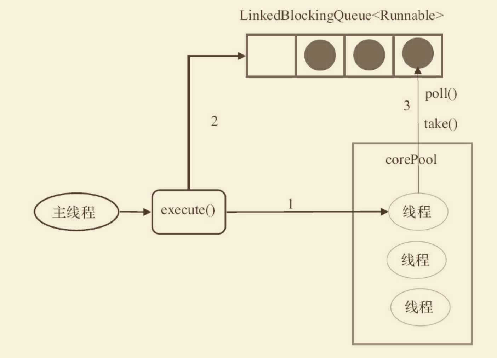

## 线程池的使用和原理
1. corePoolSize：线程池中的核心线程数，当提交一个任务时，线程池创建一个新线程执行任务，直到当前线程数等于corePoolSize；
如果当前线程数为corePoolSize，继续提交的任务被保存到阻塞队列中，等待被执行；
如果执行了线程池的prestartAllCoreThreads()方法，线程池会提前创建并启动所有核心线程。

2. maximumPoolSize：线程池中允许的最大线程数。如果当前阻塞队列满了，且继续提交任务，则创建新的线程执行任务，前提是当前线程数小于maximumPoolSize

3. keepAliveTime：线程空闲时的存活时间，即当线程没有任务执行时，继续存活的时间。默认情况下，该参数只在线程数大于corePoolSize时才有用

4. workQueue：必须是BlockingQueue阻塞队列。当线程池中的线程数超过它的corePoolSize的时候，线程会进入阻塞队列进行阻塞等待。通过workQueue，线程池实现了阻塞功能
5. RejectedExecutionHandler（饱和策略）
线程池的饱和策略，当阻塞队列满了，且没有空闲的工作线程，如果继续提交任务，必须采取一种策略处理该任务，线程池提供了5种策略：
    * （1）AbortPolicy：直接抛出异常，默认策略；
    * （2）CallerRunsPolicy：用调用者所在的线程来执行任务；
    * （3）DiscardOldestPolicy：丢弃阻塞队列中靠最前的任务，并执行当前任务；
    * （4）DiscardPolicy：直接丢弃任务；
    * （5）实现RejectedExecutionHandler接口，自定义饱和策略

### 几种排队的策略：
1. 不排队，直接提交
将任务直接交给线程处理而不保持它们，可使用SynchronousQueue
如果不存在可用于立即运行任务的线程（即线程池中的线程都在工作），则试图把任务加入缓冲队列将会失败，因此会构造一个新的线程来处理新添加的任务，并将其加入到线程池中（corePoolSize-->maximumPoolSize扩容）
Executors.newCachedThreadPool()采用的便是这种策略

2. 无界队列
可以使用LinkedBlockingQueue（基于链表的有界队列，FIFO），理论上是该队列可以对无限多的任务排队，将导致在所有corePoolSize线程都工作的情况下将新任务加入到队列中。这样，创建的线程就不会超过corePoolSize，也因此，maximumPoolSize的值也就无效了

3. 有界队列
可以使用ArrayBlockingQueue（基于数组结构的有界队列，FIFO），并指定队列的最大长度
使用有界队列可以防止资源耗尽，但也会造成超过队列大小和maximumPoolSize后，提交的任务被拒绝的问题，比较难调整和控制。

### execute 和 submit接口的区别
1. 接受参数，前者是Runnable接口，后者是Callable接口
2. 返回值，前者没有返回值，后者返回Futrue对象
3. 处理异常

### 线程池终止的方法
1. shutdown， 当线程池调用该方法时,线程池的状态则立刻变成SHUTDOWN状态。此时，则不能再往线程池中添加任何任务，否则将会抛出RejectedExecutionException异常。但是，此时线程池不会立刻退出，直到添加到线程池中的任务都已经处理完成，才会退出。
2. shutdownNow，执行该方法，线程池的状态立刻变成STOP状态，并试图停止所有正在执行的线程，不再处理还在池队列中等待的任务，当然，它会返回那些未执行的任务。 它试图终止线程的方法是通过调用Thread.interrupt()方法来实现的，如果线程中没有sleep 、wait、Condition、定时锁等应用, interrupt()方法是无法中断当前的线程的。所以，ShutdownNow()并不代表线程池就一定立即就能退出，它可能必须要等待所有正在执行的任务都执行完成了才能退出。

## FixedThreadPool
固定线程池大小的，队列是无界的。构造函数如下：
```java
public static ExecutorService newFixedThreadPool(int nThreads) {
    return new ThreadPoolExecutor(nThreads, nThreads, 0L, TimeUnit.MILLISECONDS, new LinkedBlockingQueue<Runnable>());
}
```
### FixedThreadPool的原理


1. 如果当前运行的线程数少于corePoolSize，则创建新线程来执行任务。
2. 在线程池完成预热之后（当前运行的线程数等于corePoolSize），将任务加入 LinkedBlockingQueue。
3. 线程执行完1中的任务后，会在循环中反复从LinkedBlockingQueue获取任务来执行。

### FixedThreadPool的特性
FixedThreadPool使用无界队列LinkedBlockingQueue作为线程池的工作队列（队列的容量为 Integer.MAX_VALUE）。使用无界队列作为工作队列会对线程池带来如下影响。
1. 当线程池中的线程数达到corePoolSize后，新任务将在无界队列中等待，因此线程池中 的线程数不会超过corePoolSize。
2. 由于1，使用无界队列时maximumPoolSize将是一个无效参数。
3. 由于1和2，使用无界队列时keepAliveTime将是一个无效参数。
4. 由于使用无界队列，运行中的FixedThreadPool（未执行方法shutdown()或 shutdownNow()）不会拒绝任务（不会调用RejectedExecutionHandler.rejectedExecution方法）。


## SingleThreadPool

```java
public static ExecutorService newSingleThreadExecutor() {
    return new FinalizableDelegatedExecutorService (new ThreadPoolExecutor(1, 1, 0L, TimeUnit.MILLISECONDS, new LinkedBlockingQueue<Runnable>()));
}
```
SingleThreadExecutor的corePoolSize和maximumPoolSize被设置为1。其他参数与 FixedThreadPool相同。SingleThreadExecutor使用无界队列LinkedBlockingQueue作为线程池的工 作队列（队列的容量为Integer.MAX_VALUE）。SingleThreadExecutor使用无界队列作为工作队列 对线程池带来的影响与FixedThreadPool相同，

### SingleThreadPool工作流程
1. 如果当前运行的线程数少于corePoolSize（即线程池中无运行的线程），则创建一个新线 程来执行任务。
2. 在线程池完成预热之后（当前线程池中有一个运行的线程），将任务加入LinkedBlockingQueue。
3. 线程执行完1中的任务后，会在一个无限循环中反复从LinkedBlockingQueue获取任务来 执行。

## CachedThreadPool
```java
public static ExecutorService newCachedThreadPool() {
    return new ThreadPoolExecutor(0, Integer.MAX_VALUE, 60L, TimeUnit.SECONDS, new SynchronousQueue<Runnable>());
}
```
CachedThreadPool的corePoolSize被设置为0，即corePool为空；maximumPoolSize被设置为 Integer.MAX_VALUE，即maximumPool是无界的。这里把keepAliveTime设置为60L，意味着 CachedThreadPool中的空闲线程等待新任务的最长时间为60秒，空闲线程超过60秒后将会被终止。

CachedThreadPool使用没有容量的SynchronousQueue作为线程池的工作队列，但 CachedThreadPool的maximumPool是无界的。这意味着，如果主线程提交任务的速度高于 maximumPool中线程处理任务的速度时，CachedThreadPool会不断创建新线程。极端情况下， CachedThreadPool会因为创建过多线程而耗尽CPU和内存资源


## ScheduledThreadPool
执行定时任务的线程池

## FutureTask
FutureTask除了实现Future接⼜外，还实现了Runnable接⼜。因此，FutureTask可以交给 Executor执⾏，也可以由调⽤线程直接执⾏（FutureTask.run()）。根据FutureTask.run()⽅法被执 ⾏的时机，FutureTask可以处于下⾯3种状态。

1. 未启动。FutureTask.run()⽅法还没有被执⾏之前，FutureTask处于未启动状态。当创建 ⼀个FutureTask，且没有执⾏FutureTask.run()⽅法之前，这个FutureTask处于未启动状态。
2. 已启动。FutureTask.run()⽅法被执⾏的过程中，FutureTask处于已启动状态。
3. 已完成。FutureTask.run()⽅法执⾏完后正常结束，或被取消 （FutureTask.cancel（…）），或执⾏FutureTask.run()⽅法时抛出异常⽽异常结束，FutureTask 处于已完成状态。
