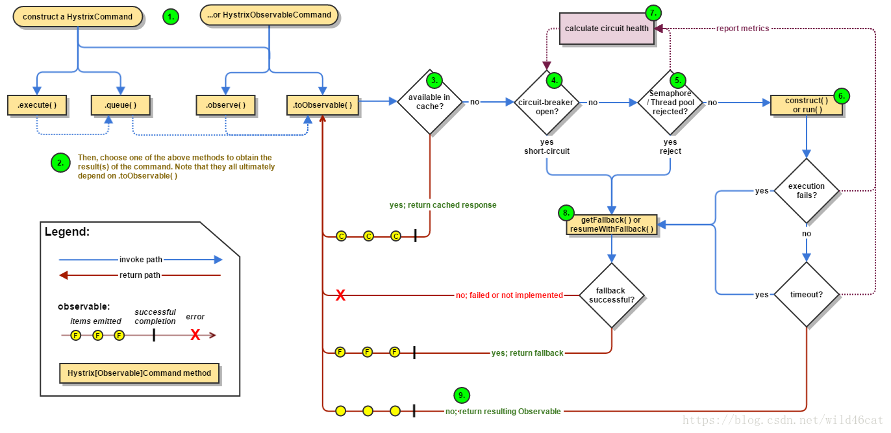

# hystrix

## hystrix工作原理

## hystrix和Sentinel对比

| 功能           | Sentinel                                                   | Hystrix                 | resilience4j                     |
| :------------- | :--------------------------------------------------------- | :---------------------- | :------------------------------- |
| 隔离策略       | 信号量隔离（并发线程数限流）                               | 线程池隔离/信号量隔离   | 信号量隔离                       |
| 熔断降级策略   | 基于响应时间、异常比率、异常数                             | 基于异常比率，异常数，  | 基于异常比率、响应时间           |
| 实时统计实现   | 滑动窗口（LeapArray）                                      | 滑动窗口（基于 RxJava） | Ring Bit Buffer                  |
| 动态规则配置   | 支持多种数据源                                             | 支持多种数据源          | 有限支持                         |
| 扩展性         | 多个扩展点                                                 | 插件的形式              | 接口的形式                       |
| 基于注解的支持 | 支持                                                       | 支持                    | 支持                             |
| 限流           | 基于 QPS，支持基于调用关系的限流                           | 有限的支持              | Rate Limiter                     |
| 流量整形       | 支持预热模式、匀速器模式、预热排队模式(流量规则处可配置)   | 不支持                  | 简单的 Rate Limiter 模式         |
| 系统自适应保护 | 支持                                                       | 不支持                  | 不支持                           |
| 控制台         | 提供开箱即用的控制台，可配置规则、查看秒级监控、机器发现等 | 简单的监控查看          | 不提供控制台，可对接其它监控系统 |