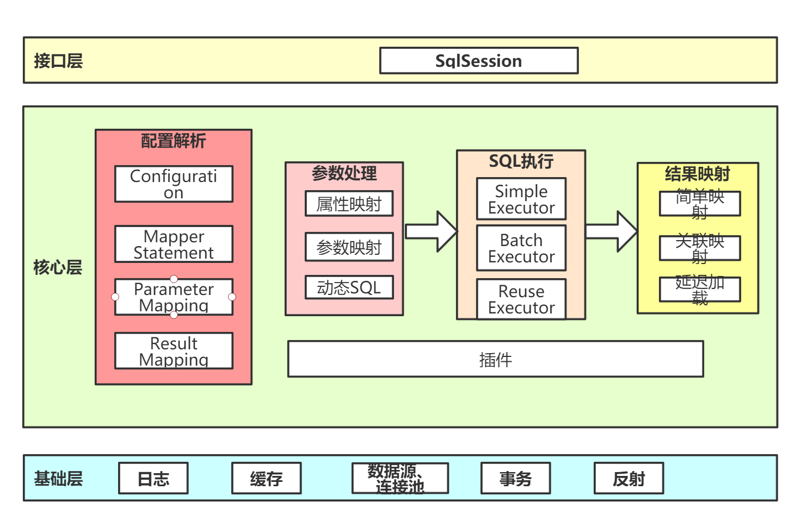

# mybatis核心
MyBatis 是一款优秀的持久层框架，它支持自定义 SQL、存储过程以及高级映射。MyBatis 免除了几乎所有的 JDBC 代码以及设置参数和获取结果集的工作。MyBatis 可以通过简单的 XML 或注解来配置和映射原始类型、接口和 Java POJO（Plain Old Java Objects，普通老式 Java 对象）为数据库中的记录

## mybatis原理？

## mybatis核心对象及其作用？
SqlSessionFactoryBuilder，创建工厂类
SqlSessionFactory，创建会话
SqlSession，提供操作接口
MapperProxy， 代理mapper接口后，用于找到sql执行

## mybatis和hibernate的优缺点
相同点

Hibernate与MyBatis都可以是通过SessionFactoryBuider由XML配置文件生成SessionFactory，然后由SessionFactory 生成Session，最后由Session来开启执行事务和SQL语句。

其中SessionFactoryBuider，SessionFactory，Session的生命周期都是差不多的。Hibernate和MyBatis都支持JDBC和JTA事务处理。

不同点

（1）hibernate是全自动，而mybatis是半自动

hibernate完全可以通过对象关系模型实现对数据库的操作，拥有完整的JavaBean对象与数据库的映射结构来自动生成sql。而mybatis仅有基本的字段映射，对象数据以及对象实际关系仍然需要通过手写sql来实现和管理。

（2）hibernate数据库移植性远大于mybatis

hibernate通过它强大的映射结构和hql语言，大大降低了对象与数据库（Oracle、MySQL等）的耦合性，而mybatis由于需要手写sql，因此与数据库的耦合性直接取决于程序员写sql的方法，如果sql不具通用性而用了很多某数据库特性的sql语句的话，移植性也会随之降低很多，成本很高。

（3）hibernate拥有完整的日志系统，mybatis则欠缺一些

hibernate日志系统非常健全，涉及广泛，包括：sql记录、关系异常、优化警告、缓存提示、脏数据警告等；而mybatis则除了基本记录功能外，功能薄弱很多。

（4）mybatis相比hibernate需要关心很多细节

hibernate配置要比mybatis复杂的多，学习成本也比mybatis高。但也正因为mybatis使用简单，才导致它要比hibernate关心很多技术细节。mybatis由于不用考虑很多细节，开发模式上与传统jdbc区别很小，因此很容易上手并开发项目，但忽略细节会导致项目前期bug较多，因而开发出相对稳定的软件很慢，而开发出软件却很快。hibernate则正好与之相反。但是如果使用hibernate很熟练的话，实际上开发效率丝毫不差于甚至超越mybatis。

（5）sql直接优化上，mybatis要比hibernate方便很多

由于mybatis的sql都是写在xml里，因此优化sql比hibernate方便很多。而hibernate的sql很多都是自动生成的，无法直接维护sql；虽有hql，但功能还是不及sql强大，见到报表等变态需求时，hql也歇菜，也就是说hql是有局限的；hibernate虽然也支持原生sql，但开发模式上却与orm不同，需要转换思维，因此使用上不是非常方便。总之写sql的灵活度上hibernate不及mybatis。

（6）缓存机制上，hibernate要比mybatis更好一些

MyBatis的二级缓存配置都是在每个具体的表-对象映射中进行详细配置，这样针对不同的表可以自定义不同的缓存机制。并且Mybatis可以在命名空间中共享相同的缓存配置和实例，通过Cache-ref来实现。

而Hibernate对查询对象有着良好的管理机制，用户无需关心SQL。所以在使用二级缓存时如果出现脏数据，系统会报出错误并提示。

总结

（1）两者相同点
Hibernate和Mybatis的二级缓存除了采用系统默认的缓存机制外，都可以通过实现你自己的缓存或为其他第三方缓存方案，创建适配器来完全覆盖缓存行为。

（2）两者不同点
Hibernate的二级缓存配置在SessionFactory生成的配置文件中进行详细配置，然后再在具体的表-对象映射中配置是那种缓存。而MyBatis在使用二级缓存时需要特别小心。如果不能完全确定数据更新操作的波及范围，避免Cache的盲目使用。否则，脏数据的出现会给系统的正常运行带来很大的隐患。

## mybatis的缓存原理
mybatis有两级缓存，一级缓存和二级缓存。
* 一级缓存是会话级别的，默认开启，维护在BaseExecutor中。
* 二级缓存是namespace共享，需要在Mapper.xml中开启，维护在CachingExecutor中。

## mybatis三种执行器的区别？
1. SimpleExecutor，使用后直接关闭Statement
2. ReuseExecutor，放在缓存中，可复用：PrepareStatement
3. BatchExecutor，支持复用而且可以批量执行update()，通过`ps.addBatch()`实现 `handler.batch(stmt)`

## Mybatis支持哪些数据源类型？
UNPOOLED：不带连接池的数据源
POOLED：带连接池的数据源，在PooledDataSource中维护PooledConnection
JNDI：使用容器的数据源，比如Tomcat配置了C3P0
自定义数据源：

## 关联查询的延迟加载是怎么实现的？
动态代理，在创建实体类对象时进行代理，在调用对象的相关方法时触发二次查询。

## Mybatis翻页的方式和区别？
* 逻辑翻页：通过RowBounds对象，在内存中分页，占用内存高，性能低下。
* 物理翻页：通过改写sql，可用插件拦截Executor实现。占用内存低，性能高。

## Mybatis如何集成到spring的？
* SqlSessionTemplate中有内部类SqlSessionInterceptor对DefaultSqlSession进行代理；
* MapperFactoryBean继承了SqlSessionDaoSupport获取SqlSessionTemplate；
* 接口注册到IOC容器中的beanClass是MapperFactoryBean

## DefaultSqlSession和SqlSessionTemplate的区别？
SqlSessionTemplate是线程安全的。
### 1）为什么 SqlSessionTemplate 是线程安全的？

其内部类 SqlSessionInterceptor 的 invoke()方法中的 getSqlSession()方法：
如果当前线程已经有存在的 SqlSession 对象，会在 ThreadLocal 的容器中拿到SqlSessionHolder，获取 DefaultSqlSession。
如果没有，则会 new 一个 SqlSession，并且绑定到 SqlSessionHolder，放到ThreadLocal 中。
SqlSessionTemplate 中在同一个事务中使用同一个 SqlSession。
调用 closeSqlSession()关闭会话时，如果存在事务，减少 holder 的引用计数。否则直接关闭 SqlSession。
### 2）在编程式的开发中，有什么方法保证 SqlSession 的线程安全？
SqlSessionManager 同时实现了 SqlSessionFactory、SqlSession 接口，通过ThreadLocal 容器维护 SqlSession

## mybatis中的设计模式
1. 工厂模式：SqlSessionFactory
2. 单例模式：SqlSessionFactory，Configuration
3. 建造者：SqlSessionFactoryBuilder
4. 装饰者模式：CachingExecor simple reuse batch三种exector的装饰，LRUCache FifoCache对PerpetualCache的装饰
5. 代理模式：Spring集成Mybatis SqlSessionInterceptor，MapperProxy，Plugin，延迟加载，Log输出（ConnectionLogger，StatementLogger）
6. 模板方法：Executor，BaseExecutor,SimpleExecutor