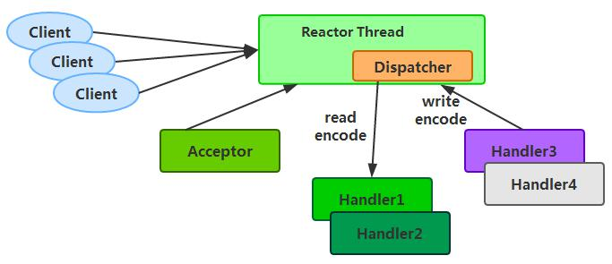
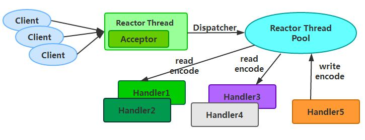
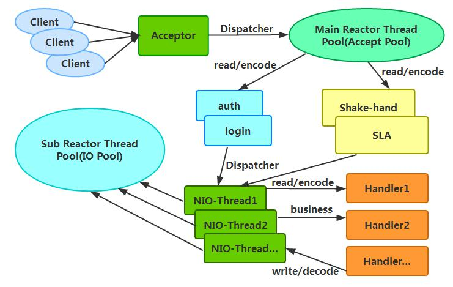
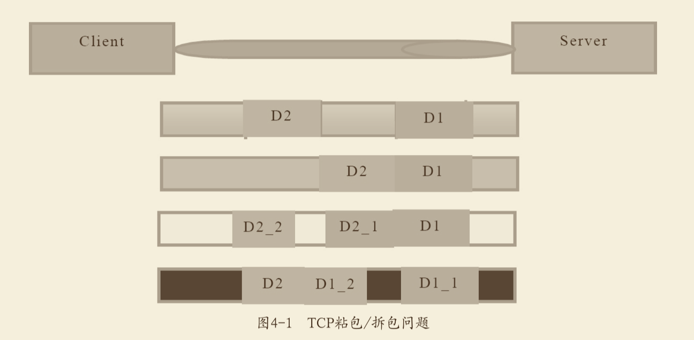

# netty核心
解决了java服务直接的通信性能问题。

## netty是什么？
Netty是业界最流⾏的NIO框架之⼀，它的健壮性、功能、性能、可定制性和可扩展性在同类框架中都是⾸屈⼀指的，它已经得到成百上千的商⽤项⽬验证，例如Hadoop的RPC框架avro，阿里巴巴的dubbo都是使⽤Netty作为底层通信框架；很多其他业界主流的RPC框架，也使⽤Netty来构建⾼性能的异步通信能⼒。

## 为什么使用netty而不使用java原生的nio做通信
1. nio操作api复杂，使用麻烦；
2. 需要熟练掌握多线程，reactor模式等技术；
3. 可能性差，需要解决断线重连，半包读写，网络问题等；
4. nio固有的epoll bug。

综上所述：自己开发一套可靠的nio程序，难度非常大，时间成本太高。所以，使用netty作为通信框架成为了业界共识。

## 传统rpc调用性能低的原因
* 1) Java 序列化机制是 Java 内部的一种对象编解码技术，无法跨语言使用；例如对于异构 系统之间的对接，Java 序列化后的码流需要能够通过其它语言反序列化成原始对象（副本）， 目前很难支持
* 2) 相比于其它开源的序列化框架，Java 序列化后的码流太大，无论是网络传输还是持久化 到磁盘，都会导致额外的资源占用；
* 3) 序列化性能差（CPU 资源占用高）

## netty高性能的原理
1. 使用reactor线程模型
2. 零拷贝，减少io次数
3. 默认使用protobuf作为序列化框架，性能高
4. 使用内存池进行内存分配

## Reactor线程模型

### 单线程模式

### 多线程模式

### 主从线程模型

## TCP粘包和拆包
一个完整的数据包被tcp分成多个数据包发送，就是粘包和拆包。

假设客户端分别发送了两个数据包D1和D2给服务端，由于服务端⼀次读取到的字节数是不 确定的，故可能存在以下4种情况。

1. 服务端分两次读取到了两个独⽴的数据包，分别是D1和D2，没有粘包和拆包；
2. 服务端⼀次接收到了两个数据包，D1和D2粘合在⼀起，被称为TCP粘包；
3. 服务端分两次读取到了两个数据包，第⼀次读取到了完整的D1包和D2包的部分内容，第⼆次读取到了D2包的剩余内容，这被称为TCP拆包；
4. 服务端分两次读取到了两个数据包，第⼀次读取到了D1包的部分内容D1_1，第⼆次 读取到了D1包的剩余内容D1_2和D2包的整包。

## TCP粘包/拆包发⽣的原因
1. 应用程序写入的字节大小大于套接字发送缓冲区大小
2. 进行了MSS大小的TCP分段
3. 以太网的payLoad大于MTU进行IP分片

## TCP粘包的解决策略
1. 消息定长，不如长度就进行补齐，如使用空格补位；
2. 在包尾加回车换行符进行分割，如ftp协议；
3. 使用消息头和消息体进行传输；
4. 更复杂的应用层协议；

## netyy如何解决tcp粘包，拆包的问题
1. LineBasedFrameDecoder和StringDecoder(换行符)
2. DelimiterBasedFrameDecoder（分隔符）
3. FixedLengthFrameDecoder（定长）

## netty高性能的设计要点
（1）采⽤异步⾮阻塞的I/O类库，基于Reactor模式实现，解决了传统同步阻塞I/O模式下⼀ 个服务端⽆法平滑地处理线性增长的客户端的问题。

（2）TCP接收和发送缓冲区使⽤直接内存代替堆内存，避免了内存复制，提升了I/O读取和 写⼊的性能。

（3）⽀持通过内存池的⽅式循环利⽤ByteBuf，避免了频繁创建和销毁ByteBuf带来的性能 损耗。

（4）可配置的I/O线程数、TCP参数等，为不同的⽤户场景提供定制化的调优参数，满⾜不 同的性能场景。

（5）采⽤环形数组缓冲区实现⽆锁化并发编程，代替传统的线程安全容器或者锁。

（6）合理地使⽤线程安全容器、原⼦类等，提升系统的并发处理能⼒。

（7）关键资源的处理使⽤单线程串⾏化的⽅式，避免多线程并发访问带来的锁竞争和额外 的CPU资源消耗问题。

（8）通过引⽤计数器及时地申请释放不再被引⽤的对象，细粒度的内存管理降低了GC的 频率，减少了频繁GC带来的时延增⼤和CPU损耗。

## netty的可靠性设计
1. 链路的有效检测；
    * 读空闲超时机制
    * 写空闲超时机制
2. 内存保护机制
    * 通过引用计数对ByteBuff等对象进行细粒度的内存申请和释放
    * 通过内存池来重用ByteBuf，节省内存
    * 可设置内存容量上线，包括ByteBuf和线程池线程数
3. 优雅停机

## netty的可定制性
1. 基于责任链模式，便于业务逻辑的拦截定制，和扩展
2. 基于接口开发，通过实现接口用户可以自定义实现
3. 提供大量工厂类，通过重载可以按需创建对象
4. 提高大量系统参数供用户设置

## 使用netty实现自定义的协议

## netty内存模型
1. buf如何创建和释放？
2. 如何保证没有内存碎片？

> 参考《netty权威指南》，《netty实战》。
