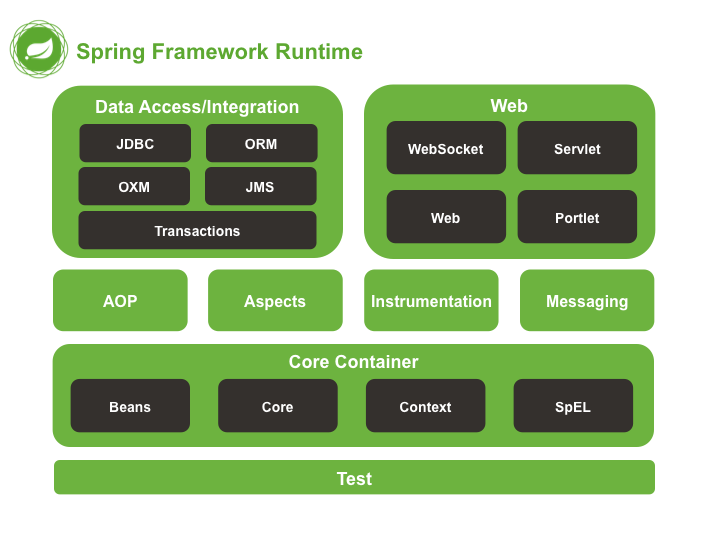
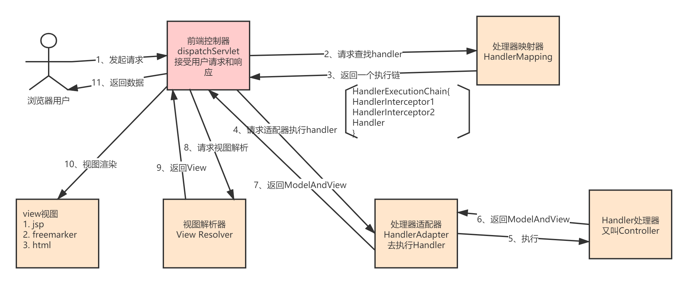

# spring核心
Spring是一种轻量级框架，旨在提高开发人员的开发效率以及系统的可维护性。

我们一般说的Spring框架就是Spring Framework，它是很多模块的集合，使用这些模块可以很方便地协助我们进行开发。这些模块是核心容器、数据访问/集成、Web、AOP（面向切面编程）、工具、消息和测试模块。比如Core Container中的Core组件是Spring所有组件的核心，Beans组件和Context组件是实现IOC和DI的基础，AOP组件用来实现面向切面编程。

Spring官网（https://spring.io/）列出的Spring的6个特征：

* 核心技术：依赖注入（DI），AOP，事件（Events），资源，i18n，验证，数据绑定，类型转换，SpEL。
* 测试：模拟对象，TestContext框架，Spring MVC测试，WebTestClient。
* 数据访问：事务，DAO支持，JDBC，ORM，编组XML。
* Web支持：Spring MVC和Spring WebFlux Web框架。
* 集成：远程处理，JMS，JCA，JMX，电子邮件，任务，调度，缓存。
* 语言：Kotlin，Groovy，动态语言。

## spring核心模块有哪些？

1. Spring Core：基础，可以说Spring其他所有的功能都依赖于该类库。主要提供IOC和DI功能。
2. Spring Aspects：该模块为与AspectJ的集成提供支持。
3. Spring AOP：提供面向方面的编程实现。
4. Spring JDBC：Java数据库连接。
5. Spring JMS：Java消息服务。
6. Spring ORM：用于支持Hibernate等ORM工具。
7. Spring Web：为创建Web应用程序提供支持。
8. Spring Test：提供了对JUnit和TestNG测试的支持。

## 谈谈自己对于Spring IOC和AOP的理解
IOC（Inversion Of Controll，控制反转）是一种设计思想，就是将原本在程序中手动创建对象的控制权，交由给Spring框架来管理。IOC在其他语言中也有应用，并非Spring特有。IOC容器是Spring用来实现IOC的载体，IOC容器实际上就是一个Map(key, value)，Map中存放的是各种对象。

将对象之间的相互依赖关系交给IOC容器来管理，并由IOC容器完成对象的注入。这样可以很大程度上简化应用的开发，把应用从复杂的依赖关系中解放出来。IOC容器就像是一个工厂一样，当我们需要创建一个对象的时候，只需要配置好配置文件/注解即可，完全不用考虑对象是如何被创建出来的。在实际项目中一个Service类可能由几百甚至上千个类作为它的底层，假如我们需要实例化这个Service，可能要每次都搞清楚这个Service所有底层类的构造函数，这可能会把人逼疯。如果利用IOC的话，你只需要配置好，然后在需要的地方引用就行了，大大增加了项目的可维护性且降低了开发难度。

AOP（Aspect-Oriented Programming，面向切面编程）能够将那些与业务无关，却为业务模块所共同调用的逻辑或责任（例如事务处理、日志管理、权限控制等）封装起来，便于减少系统的重复代码，降低模块间的耦合度，并有利于未来的可扩展性和可维护性。

## spring用了哪些代理？有什么不同？
* jdk自带的代理，实现接口来代理
* cglib代理，继承来代理
如果要代理的对象实现了某个接口，那么Spring AOP就会使用JDK动态代理去创建代理对象；而对于没有实现接口的对象，就无法使用JDK动态代理，转而使用CGlib动态代理生成一个被代理对象的子类来作为代理。
### (1) JDK的动态代理
JDK的动态代理主要涉及java.lang.reflect包中的两个类：Proxy和InvocationHandler。其中InvocationHandler只是一个接口，可以通过实现该接口定义横切逻辑，并通过反射机制调用目标类的代码，动态的将横切逻辑与业务逻辑织在一起。而Proxy利用InvocationHandler动态创建一个符合某一接口的实例，生成目标类的代理对象。
其代理对象必须是某个接口的实现, 它是通过在运行期间创建一个接口的实现类来完成对目标对象的代理.只能实现接口的类生成代理,而不能针对类

### (2)CGLib
CGLib采用底层的字节码技术，为一个类创建子类，并在子类中采用方法拦截的技术拦截所有父类的调用方法，并顺势织入横切逻辑.它运行期间生成的代理对象是目标类的扩展子类.所以无法通知final、private的方法,因为它们不能被覆写.是针对类实现代理,主要是为指定的类生成一个子类,覆盖其中方法.
在spring中默认情况下使用JDK动态代理实现AOP,如果proxy-target-class设置为true或者使用了优化策略那么会使用CGLIB来创建动态代理.Spring　AOP在这两种方式的实现上基本一样．以JDK代理为例，会使用JdkDynamicAopProxy来创建代理，在invoke()方法首先需要织入到当前类的增强器封装到拦截器链中，然后递归的调用这些拦截器完成功能的织入．最终返回代理对象．

## spring的AOP如何实现的？

### spring中aop应用在哪些地方
权限认证
日志
事务管理
懒加载
上下文处理
错误处理（异常捕获）
缓存处理

## spring AOP有哪些切面通知
Spring切面可以应用五种类型的通知：
1. before：前置通知，在一个方法执行前被调用。
2. after: 在方法执行之后调用的通知，无论方法执行是否成功。
3. after-returning: 仅当方法成功完成后执行的通知。
4. after-throwing: 在方法抛出异常退出时执行的通知。
5. around: 在方法执行之前和之后调用的通知。

## spring的bean的单例如何保证？

## spring什么时候使用jdk代理，什么时候使用cglib？

## Spring支持的几种bean的作用域
Spring框架支持以下五种bean的作用域：
1. singleton : bean在每个Spring ioc 容器中只有一个实例。（默认方式）
2. prototype：一个bean的定义可以有多个实例。
3. request：每次http请求都会创建一个bean，该作用域仅在基于web的Spring ApplicationContext情形下有效。
4. session：在一个HTTP Session中，一个bean定义对应一个实例。该作用域仅在基于web的Spring ApplicationContext情形下有效。
5. global-session：在一个全局的HTTP Session中，一个bean定义对应一个实例。该作用域仅在基于web的Spring ApplicationContext情形下有效。

## Spring框架中bean的生命周期
1. Bean容器找到配置文件中Spring Bean的定义。
2. Bean容器利用Java Reflection API创建一个Bean的实例。
3. 如果涉及到一些属性值，利用set()方法设置一些属性值。
4. 如果Bean实现了BeanNameAware接口，调用setBeanName()方法，传入Bean的名字。
5. 如果Bean实现了BeanClassLoaderAware接口，调用setBeanClassLoader()方法，传入ClassLoader对象的实例。
6. 如果Bean实现了BeanFactoryAware接口，调用setBeanClassFacotory()方法，传入ClassLoader对象的实例。
7. 与上面的类似，如果实现了其他*Aware接口，就调用相应的方法。
8. 如果有和加载这个Bean的Spring容器相关的BeanPostProcessor对象，执行postProcessBeforeInitialization()方法。
9. 如果Bean实现了InitializingBean接口，执行afeterPropertiesSet()方法。
10. 如果Bean在配置文件中的定义包含init-method属性，执行指定的方法。
11. 如果有和加载这个Bean的Spring容器相关的BeanPostProcess对象，执行postProcessAfterInitialization()方法。
12. 当要销毁Bean的时候，如果Bean实现了DisposableBean接口，执行destroy()方法。
13. 当要销毁Bean的时候，如果Bean在配置文件中的定义包含destroy-method属性，执行指定的方法。


## spring自动装配有哪些方式
自动装配提供五种不同的模式供Spring容器用来自动装配beans之间的依赖注入:

* no：默认的方式是不进行自动装配，通过手工设置ref 属性来进行装配bean。
* byName：通过参数名自动装配，Spring容器查找beans的属性，这些beans在XML配置文件中被设置为byName。之后容器试图匹配、装配和该bean的属性具有相同名字的bean。
* byType：通过参数的数据类型自动自动装配，Spring容器查找beans的属性，这些beans在XML配置文件中被设置为byType。之后容器试图匹配和装配和该bean的属性类型一样的bean。如果有多个bean符合条件，则抛出错误。
* constructor：这个同byType类似，不过是应用于构造函数的参数。如果在BeanFactory中不是恰好有一个bean与构造函数参数相同类型，则抛出一个严重的错误。
* autodetect：如果有默认的构造方法，通过 construct的方式自动装配，否则使用 byType的方式自动装配。

## spring事务
### Spring事务管理的方式有几种？
1.编程式事务：在代码中硬编码（不推荐使用）。
2.声明式事务：在配置文件中配置（推荐使用），分为基于XML的声明式事务和基于注解的声明式事务。

### Spring事务中的隔离级别有哪几种？
在TransactionDefinition接口中定义了五个表示隔离级别的常量：

1. ISOLATION_DEFAULT：使用后端数据库默认的隔离级别，Mysql默认采用的REPEATABLE_READ隔离级别；Oracle默认采用的READ_COMMITTED隔离级别。
2. ISOLATION_READ_UNCOMMITTED：最低的隔离级别，允许读取尚未提交的数据变更，可能会导致脏读、幻读或不可重复读。
3. ISOLATION_READ_COMMITTED：允许读取并发事务已经提交的数据，可以阻止脏读，但是幻读或不可重复读仍有可能发生
4. ISOLATION_REPEATABLE_READ：对同一字段的多次读取结果都是一致的，除非数据是被本身事务自己所修改，可以阻止脏读和不可重复读，但幻读仍有可能发生。
5. ISOLATION_SERIALIZABLE：最高的隔离级别，完全服从ACID的隔离级别。所有的事务依次逐个执行，这样事务之间就完全不可能产生干扰，也就是说，该级别可以防止脏读、不可重复读以及幻读。但是这将严重影响程序的性能。通常情况下也不会用到该级别

### Spring事务中有哪几种事务传播行为？
在TransactionDefinition接口中定义了七个表示事务传播行为的常量。

支持当前事务的情况：

* PROPAGATION_REQUIRED：如果当前存在事务，则加入该事务；如果当前没有事务，则创建一个新的事务。
* PROPAGATION_SUPPORTS： 如果当前存在事务，则加入该事务；如果当前没有事务，则以非事务的方式继续运行。
* PROPAGATION_MANDATORY： 如果当前存在事务，则加入该事务；如果当前没有事务，则抛出异常。（mandatory：强制性）。

不支持当前事务的情况：

* PROPAGATION_REQUIRES_NEW： 创建一个新的事务，如果当前存在事务，则把当前事务挂起。
* PROPAGATION_NOT_SUPPORTED： 以非事务方式运行，如果当前存在事务，则把当前事务挂起。
* PROPAGATION_NEVER： 以非事务方式运行，如果当前存在事务，则抛出异常。

其他情况：
PROPAGATION_NESTED： 如果当前存在事务，则创建一个事务作为当前事务的嵌套事务来运行；如果当前没有事务，则该取值等价于PROPAGATION_REQUIRED。


## springmvc的原理


1. 客户端（浏览器）发送请求，直接请求到DispatcherServlet。
2. DispatcherServlet根据请求信息调用HandlerMapping，解析请求对应的Handler。
3. 解析到对应的Handler（也就是我们平常说的Controller控制器）。
4. HandlerAdapter会根据Handler来调用真正的处理器来处理请求和执行相对应的业务逻辑。
5. 处理器处理完业务后，会返回一个ModelAndView对象，Model是返回的数据对象，View是逻辑上的View。
6. ViewResolver会根据逻辑View去查找实际的View。
7. DispatcherServlet把返回的Model传给View（视图渲染）。
8. 把View返回给请求者（浏览器）。


## spring注解
### 常用的注解
@Controller, @Service, @Repository,@Component目前4种注解意思是一样，并没有什么区别，区别只是名字不同。

@PostConstruct 和 @PreDestory 

@Resource 和 @Autowired，@Qualifier

@Async

@RequestBody，@RequestMapping，@CrossOrigin，@RequestParam，@ResponseStatus，@ControllerAdvice，，，，，，，
@PathVariable，@RequestHeader，@CookieValue，@RequestParam, @RequestBody，@SessionAttributes, @ModelAttribute;

## Resource 是如何被查找、加载的？
Resource 接口是 Spring 资源访问策略的抽象，它本身并不提供任何资源访问实现，具体的资源访问由该接口的实现类完成——每个实现类代表一种资源访问策略。 Spring 为 Resource 接口提供了如下实现类：

1. UrlResource：访问网络资源的实现类。
2. ClassPathResource：访问类加载路径里资源的实现类。
3. FileSystemResource：访问文件系统里资源的实现类。
4. ServletContextResource：访问相对于 ServletContext 路径里的资源的实现类：
5. InputStreamResource：访问输入流资源的实现类。
6. ByteArrayResource：访问字节数组资源的实现类。 这些 Resource 实现类，针对不同的的底层资源，提供了相应的资源访问逻辑，并提供便捷的包装，以利于客户端程序的资源访问。

## spring如何解决循环依赖的？
例子：两个Bean，StudentA，StudentB，互相依赖
1、如果两个bean都用构造方法注入，无法解决，会报错
```
The dependencies of some of the beans in the application context form a cycle:

┌─────┐
|  studentA defined in file [D:\work\features-research\target\classes\com\mcg\framwork\featuresresearch\beans\StudentA.class]
↑     ↓
|  studentB defined in file [D:\work\features-research\target\classes\com\mcg\framwork\featuresresearch\beans\StudentB.class]
└─────┘
```
2、一个使用@Autowired，一个使用构造方法，分两种情况，按照类加载顺序，StudentA在前，StudentA可以构造方法注入StudentB，可以正常启动。反之会启动失败。

3、都是用@Autowired注入，正常启动


>参考文章：1. https://www.cnblogs.com/better-farther-world2099/articles/11585939.html  
>2. https://zhuanlan.zhihu.com/p/84267654

## BeanFactory和FactoryBean的区别

## 两个方法都有AOP配置，方法之间相互调用，切面如何执行？


## 两个方法都是用事务注解，内部互相调用，结果如何。


> 参考《spring技术内幕》。
