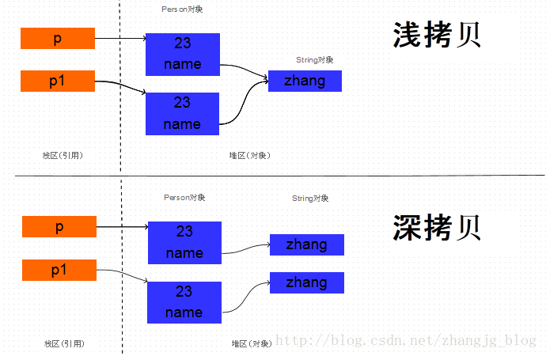

## 深copy和浅copy
浅copy只是复制对象的引用，一旦引用的对象发生改变，copy的对象也会改变。本质上是对象地址的引用。

深copy是从新构造一个对象，对象的所有字段都和源对象一致。但是对象的地址的不一样的，改变源对象不会有影响。


## clone的使用
覆盖Object中的clone方法， 实现浅拷贝。
实现Cloneable接口。假如这个对象引用了其它的对象，引用对象也必须实现Cloneable接口。

深拷贝和彻底深拷贝，在创建不可变对象时，可能对程序有着微妙的影响，可能会决定我们创建的不可变对象是不是真的不可变。clone的一个重要的应用也是用于不可变对象的创建。

## 序列化和反序列化
Java序列化是指把Java对象保存为二进制字节码的过程，Java反序列化是指把二进制码重新转换成Java对象的过程。

那么为什么需要序列化呢？

第一种情况是：一般情况下Java对象的声明周期都比Java虚拟机的要短，实际应用中我们希望在JVM停止运行之后能够持久化指定的对象，这时候就需要把对象进行序列化之后保存。

第二种情况是：需要把Java对象通过网络进行传输的时候。因为数据只能够以二进制的形式在网络中进行传输，因此当把对象通过网络发送出去之前需要先序列化成二进制数据，在接收端读到二进制数据之后反序列化成Java对象

## 反射
JAVA反射机制是在运行状态中，对于任意一个类，都能够知道这个类的所有属性和方法；对于任意一个对象，都能够调用它的任意一个方法和属性；这种动态获取的信息以及动态调用对象的方法的功能称为java语言的反射机制。

```java
    //1.加载Class对象
    Class clazz = Class.forName("fanshe.Student");
    //2.获取所有公有构造方法
    System.out.println("**********************所有公有构造方法*********************************");
    Constructor[] conArray = clazz.getConstructors();
    for(Constructor c : conArray){
        System.out.println(c);
    }

    System.out.println("******所有的构造方法(包括：私有、受保护、默认、公有)***");
    conArray = clazz.getDeclaredConstructors();
    for(Constructor c : conArray){
        System.out.println(c);
    }

    System.out.println("*********获取公有、无参的构造方法*****");
    Constructor con = clazz.getConstructor(null);
    //1>、因为是无参的构造方法所以类型是一个null,不写也可以：这里需要的是一个参数的类型，切记是类型
    //2>、返回的是描述这个无参构造函数的类对象。

    System.out.println("con = " + con);
    //调用构造方法
    Object obj = con.newInstance();

    System.out.println("***********获取私有构造方法，并调用***");
    con = clazz.getDeclaredConstructor(char.class);
    System.out.println(con);
    //调用构造方法
    con.setAccessible(true);//暴力访问(忽略掉访问修饰符)
    obj = con.newInstance('男');
```

## 内省
在计算机科学中，内省是指计算机程序在运行时（Run time）检查对象（Object）类型的一种能力，通常也可以称作运行时类型检查。 不应该将内省和反射混淆。相对于内省，反射更进一步，是指计算机程序在运行时（Run time）可以访问、检测和修改它本身状态或行为的一种能力。

## 内省和反射有什么区别？

反射是在运行状态把Java类中的各种成分映射成相应的Java类，可以动态的获取所有的属性以及动态调用任意一个方法，强调的是运行状态。

内省(IntroSpector)是Java 语言对 Bean 类属性、事件的一种缺省处理方法。　JavaBean是一种特殊的类，主要用于传递数据信息，这种类中的方法主要用于访问私有的字段，且方法名符合某种命名规则。如果在两个模块之间传递信息，可以将信息封装进JavaBean中，这种对象称为“值对象”(Value Object)，或“VO”。方法比较少。这些信息储存在类的私有变量中，通过set()、get()获得。内省机制是通过反射来实现的，BeanInfo用来暴露一个bean的属性、方法和事件，以后我们就可以操纵该JavaBean的属性。

## 泛型
泛型，即“参数化类型”。一提到参数，最熟悉的就是定义方法时有形参，然后调用此方法时传递实参。那么参数化类型怎么理解呢？顾名思义，就是将类型由原来的具体的类型参数化，类似于方法中的变量参数，此时类型也定义成参数形式（可以称之为类型形参），然后在使用/调用时传入具体的类型（类型实参）。

泛型的本质是为了参数化类型（在不创建新的类型的情况下，通过泛型指定的不同类型来控制形参具体限制的类型）。也就是说在泛型使用过程中，操作的数据类型被指定为一个参数，这种参数类型可以用在类、接口和方法中，分别被称为泛型类、泛型接口、泛型方法。

**泛型只在编译阶段有效。看下面的代码：**
```java
List<String> stringArrayList = new ArrayList<String>();
List<Integer> integerArrayList = new ArrayList<Integer>();

Class classStringArrayList = stringArrayList.getClass();
Class classIntegerArrayList = integerArrayList.getClass();

if(classStringArrayList.equals(classIntegerArrayList)){
    Log.d("泛型测试","类型相同");
}
```

输出结果：D/泛型测试: 类型相同。

通过上面的例子可以证明，在编译之后程序会采取去泛型化的措施。也就是说Java中的泛型，只在编译阶段有效。在编译过程中，正确检验泛型结果后，会将泛型的相关信息擦出，并且在对象进入和离开方法的边界处添加类型检查和类型转换的方法。也就是说，泛型信息不会进入到运行时阶段

## 异常处理
程序运行时，发生的不被期望的事件，它阻止了程序按照程序员的预期正常执行，这就是异常。异常发生时，是任程序自生自灭，立刻退出终止，还是输出错误给用户？或者用C语言风格：用函数返回值作为执行状态？。

Java提供了更加优秀的解决办法：异常处理机制。

异常处理机制能让程序在异常发生时，按照代码的预先设定的异常处理逻辑，针对性地处理异常，让程序尽最大可能恢复正常并继续执行，且保持代码的清晰。
Java中的异常可以是函数中的语句执行时引发的，也可以是程序员通过throw 语句手动抛出的，只要在Java程序中产生了异常，就会用一个对应类型的异常对象来封装异常，JRE就会试图寻找异常处理程序来处理异常。

Throwable类是Java异常类型的顶层父类，一个对象只有是 Throwable 类的（直接或者间接）实例，他才是一个异常对象，才能被异常处理机制识别。JDK中内建了一些常用的异常类，我们也可以自定义异常。


