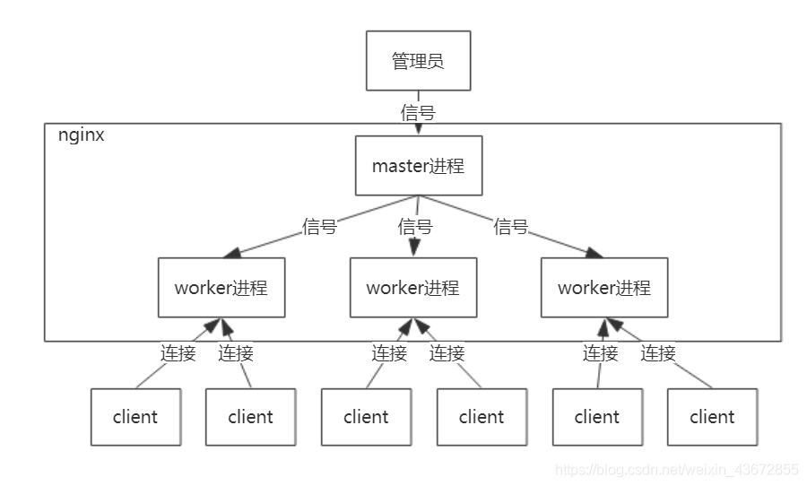
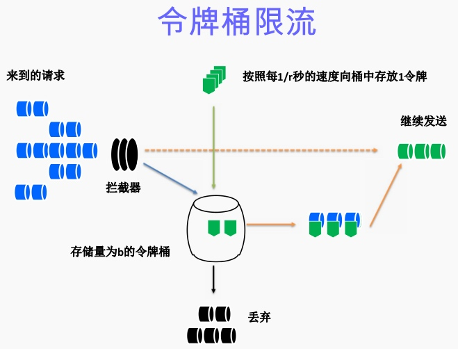
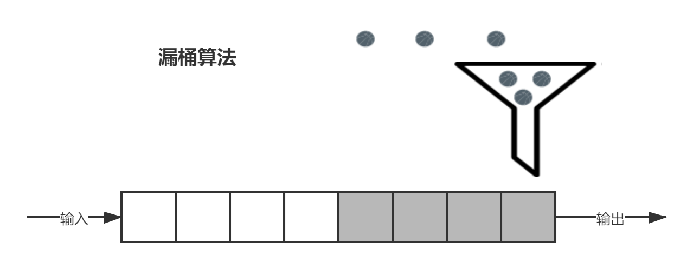

## nginx是什么？

Nginx是一款[轻量级](https://baike.baidu.com/item/轻量级/10002835)的[Web](https://baike.baidu.com/item/Web/150564) 服务器/[反向代理](https://baike.baidu.com/item/反向代理/7793488)服务器及[电子邮件](https://baike.baidu.com/item/电子邮件/111106)（IMAP/POP3）代理服务器，在BSD-like 协议下发行。其特点是占有内存少，[并发](https://baike.baidu.com/item/并发/11024806)能力强，事实上nginx的并发能力在同类型的网页服务器中表现较好，中国大陆使用nginx网站用户有：百度、[京东](https://baike.baidu.com/item/京东/210931)、[新浪](https://baike.baidu.com/item/新浪/125692)、[网易](https://baike.baidu.com/item/网易/185754)、[腾讯](https://baike.baidu.com/item/腾讯/112204)、[淘宝](https://baike.baidu.com/item/淘宝/145661)等。

## nginx高性能的原因？

1、epoll 多路复用

2、master worker 进程模型



3、协程机制

1. 依附于线程的内存模型，切换开销小
2. 遇阻塞及归还执行权，代码同步
3. 无需加锁


## nginx的工作原理


## nginx的负载均衡策略？

**nginx自带负载均衡算法：**

1. 轮训、

   1. 原理：**每个请求按时间顺序逐一分配到不同的后端服务器,也是最简单的配置算法;如果后端服务器down掉，能自动剔除**

   2. 配置：

      ```nginx
      upstream testround.com {
          server 192.168.1.1:8080 ;
          server 192.168.1.2:8081 ;
          server 192.168.1.3:8082 ;
      }
      ```

      

2. ip_hash、

   1. 原理：**每个请求按访问IP的hash值结果进行分配，同一个IP客户端固定访问一个后端服务器。可以保证来自同一ip的请求被打到固定的机器上，可以解决session问题。如果后端服务器down掉，要手工down掉。**

   2. 配置：

      ```nginx
      upstream testiphash.com {
          #后端服务器访问规则
          ip_hash;
          server 192.168.1.1:8080 ;
          server 192.168.1.2:8081 ;
          server 192.168.1.3:8082 ;
      }
      ```

      

3. 最少连接、

   1. 原理：**指定轮询几率，weight和访问比率成正比，用于后端服务器性能不均的情况。weight的值越大分配到的访问概率越高**

   2. 配置：

      ```nginx
      upstream testweight.com {
          #后端服务器访问规则
          server 192.168.1.1:8080 weight=2;
          server 192.168.1.2:8081 weight=2;
      }
      ```

      

4. 权重算法。

   1. 原理：**把请求转发给连接数较少的后端服务器进行处理**

   2. 配置：

      ```nginx
      upstream testleastconn.com {
          least_conn;
          server 192.168.1.1:8080;
          server 192.168.1.2:8081;
      }
      ```

      

   

**第三方负载均衡：**

另外有2种是第三方的(不做详解)：

1. fair（第三方） 响应时间方式 ，

   1. 原理：动态地根据后端服务器的处理处理效率和响应时间对请求进行均衡分配，响应时间短、处理效率高的服务器分配到请求的概率高，响应时间长、处理效率低的服务器分配到请求的概率低

   2. 配置：需要安装upstream_fair模块

      ```nginx
      upstream backserver {
          server server1;
          server server2;
          fair;
      }
      ```

      

2. url_hash（第三方） 依据URL分配方式

   1. 原理：按访问url的hash结果来分配请求，使每个url定向到同一个后端服务器，可以进一步提高后端缓存服务器的效率

   2. 配置：

      ```nginx
      upstream backserver {
          server squid1:3128;
          server squid2:3128;
          hash $request_uri;
          hash_method crc32;
      }
      ```


## nginx限流

### 限流算法

**令牌桶算法:**



- 令牌以固定速率产生，并缓存到令牌桶中；
- 令牌桶放满时，多余的令牌被丢弃；
- 请求要消耗等比例的令牌才能被处理；
- 令牌不够时，请求被缓存。


**漏桶算法：**



- 水（请求）从上方倒入水桶，从水桶下方流出（被处理）；
- 来不及流出的水存在水桶中（缓冲），以固定速率流出；
- 水桶满后水溢出（丢弃）。
- 这个算法的核心是：缓存请求、匀速处理、多余的请求直接丢弃。

从作用上来说，漏桶和令牌桶算法最明显的区别就是是否允许突发流量(burst)的处理，漏桶算法能够强行限制数据的实时传输（处理）速率，对突发流量不做额外处理；而令牌桶算法能够在限制数据的平均传输速率的同时允许某种程度的突发传输。

> Nginx按请求速率限速模块使用的是漏桶算法，即能够强行保证请求的实时处理速度不会超过设置的阈值


> 参考《nginx从入门到精通》，《nginx官方文档》
