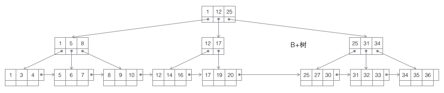
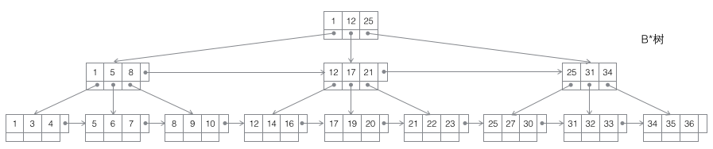

## 二叉树
每个节点最多有两个叶子节点。

## 完全二叉树
叶节点只能出现在最下层和次下层，并且最下面一层的结点都集中在该层最左边的若干位置的二叉树。
平衡二叉树
左右两个子树的高度差的绝对值不超过1，并且左右两个子树都是一棵平衡二叉树。

## 二叉查找树(Binary Search Tree)
也称有序二叉树（ordered binary tree）,排序二叉树（sorted binary tree）。

## 红黑树
《最容易懂得红黑树》
添加阶段后，左旋或者右旋从而再次达到平衡。

## 二叉查找树,B-，B+，B*树
MySQL是基于B+树聚集索引组织表
《B-树，B+树，B*树详解》
《B-树，B+树与B*树的优缺点比较》
B+ 树的叶子节点链表结构相比于 B- 树便于扫库，和范围检索。

1. 搜索二叉树：每个节点有两个子节点，数据量的增大必然导致高度的快速增加，显然这个不适合作为大量数据存储的基础结构。

2. B树：一棵m阶B树是一棵平衡的m路搜索树。最重要的性质是每个非根节点所包含的关键字个数 j 满足：┌m/2┐ - 1 <= j <= m - 1；一个节点的子节点数量会比关键字个数多1，这样关键字就变成了子节点的分割标志。一般会在图示中把关键字画到子节点中间，非常形象，也容易和后面的B+树区分。由于数据同时存在于叶子节点和非叶子结点中，无法简单完成按顺序遍历B树中的关键字，必须用中序遍历的方法。

3. B+树：一棵m阶B树是一棵平衡的m路搜索树。最重要的性质是每个非根节点所包含的关键字个数 j 满足：┌m/2┐ - 1 <= j <= m；子树的个数最多可以与关键字一样多。非叶节点存储的是子树里最小的关键字。同时数据节点只存在于叶子节点中，且叶子节点间增加了横向的指针，这样顺序遍历所有数据将变得非常容易。

4. B*树：一棵m阶B树是一棵平衡的m路搜索树。最重要的两个性质是1每个非根节点所包含的关键字个数 j 满足：┌m2/3┐ - 1 <= j <= m；2非叶节点间添加了横向指针。

## LSM 树
LSM（Log-Structured Merge-Trees）和 B+ 树相比，是牺牲了部分读的性能来换取写的性能(通过批量写入)，实现读写之间的。 Hbase、LevelDB、Tair（Long DB）、nessDB 采用 LSM 树的结构。LSM可以快速建立索引。

## LSM树 VS B+树

B+ 树读性能好，但由于需要有序结构，当key比较分散时，磁盘寻道频繁，造成写性能。
LSM 是将一个大树拆分成N棵小树，先写到内存（无寻道问题，性能高），在内存中构建一颗有序小树（有序树），随着小树越来越大，内存的小树会flush到磁盘上。当读时，由于不知道数据在哪棵小树上，因此必须遍历（二分查找）所有的小树，但在每颗小树内部数据是有序的。
《LSM树（Log-Structured Merge Tree）存储引擎》

极端的说，基于LSM树实现的HBase的写性能比MySQL高了一个数量级，读性能低了一个数量级。
优化方式：Bloom filter 替代二分查找；compact 小数位大树，提高查询性能。
Hbase 中，内存中达到一定阈值后，整体flush到磁盘上、形成一个文件（B+数），HDFS不支持update操作，所以Hbase做整体flush而不是merge update。flush到磁盘上的小树，定期会合并成一个大树。