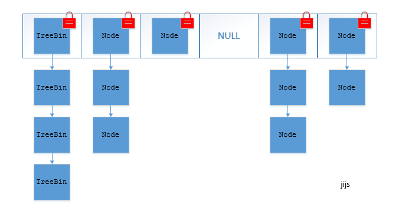

## vector
list的线程安全版本。add和get都是同步方法，效率比较低。不建议使用。

## ConcurrentHashMap 和 Hashtable 的区别
ConcurrentHashMap 和 Hashtable 的区别主要体现在实现线程安全的方式上不同。

1、底层数据结构： JDK1.7的 ConcurrentHashMap 底层采用 分段的数组+链表 实现，JDK1.8 采用的数据结构跟HashMap1.8的结构一样，数组+链表/红黑二叉树。Hashtable 和 JDK1.8 之前的 HashMap 的底层数据结构类似都是采用 数组+链表 的形式，数组是 HashMap 的主体，链表则是主要为了解决哈希冲突而存在的；

2、实现线程安全的方式（重要）： ① 在JDK1.7的时候，ConcurrentHashMap（分段锁） 对整个桶数组进行了分割分段(Segment)，每一把锁只锁容器其中一部分数据，多线程访问容器里不同数据段的数据，就不会存在锁竞争，提高并发访问率。 到了 JDK1.8 的时候已经摒弃了Segment的概念，而是直接用 Node 数组+链表+红黑树的数据结构来实现，并发控制使用 synchronized 和 CAS 来操作。（JDK1.6以后 对 synchronized锁做了很多优化） 整个看起来就像是优化过且线程安全的 HashMap，虽然在JDK1.8中还能看到 Segment 的数据结构，但是已经简化了属性，只是为了兼容旧版本；② Hashtable(同一把锁) :使用 synchronized 来保证线程安全，效率非常低下。当一个线程访问同步方法时，其他线程也访问同步方法，可能会进入阻塞或轮询状态，如使用 put 添加元素，另一个线程不能使用 put 添加元素，也不能使用 get，竞争会越来越激烈效率越低。
两者的对比图：





## copyOnWriteList

CopyOnWriteArrayList 类的所有可变操作（add，set 等等）都是通过创建底层数组的新副本来实现的。当 List 需要被修改的时候，我并不修改原有内容，而是对原有数据进行一次复制，将修改的内容写入副本。写完之后，再将修改完的副本替换原来的数据，这样就可以保证写操作不会影响读操作了。

从 CopyOnWriteArrayList 的名字就能看出CopyOnWriteArrayList 是满足CopyOnWrite 的 ArrayList，所谓CopyOnWrite 也就是说：在计算机，如果你想要对一块内存进行修改时，我们不在原有内存块中进行写操作，而是将内存拷贝一份，在新的内存中进行写操作，写完之后呢，就将指向原来内存指针指向新的内存，原来的内存就可以被回收掉了。
 
### CopyOnWriteArrayList 读取操作的实现
读取操作没有任何同步控制和锁操作，理由就是内部数组 array 不会发生修改，只会被另外一个 array 替换，因此可以保证数据安全。
```java
    /** The array, accessed only via getArray/setArray. */
    private transient volatile Object[] array;
    public E get(int index) {
        return get(getArray(), index);
    }
    @SuppressWarnings("unchecked")
    private E get(Object[] a, int index) {
        return (E) a[index];
    }
    final Object[] getArray() {
        return array;
    }

```
### CopyOnWriteArrayList 写入操作的实现
CopyOnWriteArrayList 写入操作 add() 方法在添加集合的时候加了锁，保证了同步，避免了多线程写的时候会 copy 出多个副本出来。
```java
    /**
     * Appends the specified element to the end of this list.
     *
     * @param e element to be appended to this list
     * @return {@code true} (as specified by {@link Collection#add})
     */
    public boolean add(E e) {
        final ReentrantLock lock = this.lock;
        lock.lock();//加锁
        try {
            Object[] elements = getArray();
            int len = elements.length;
            Object[] newElements = Arrays.copyOf(elements, len + 1);//拷贝新数组
            newElements[len] = e;
            setArray(newElements);
            return true;
        } finally {
            lock.unlock();//释放锁
        }
    }

```