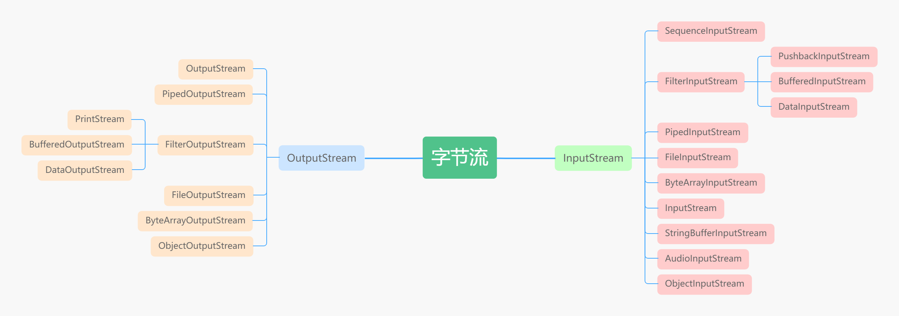

# javaIo流详解
## 字节流和字符流的区别
字节流读取的时候，读到一个字节就返回一个字节； 字符流使用了字节流读到一个或多个字节（中文对应的字节 数是两个，在 UTF-8 码表中是 3 个字节）时。先去查指定的编码表，将查到的字符返回。 字节流可以处理所有类型数 据，如：图片，MP3，AVI 视频文件，而字符流只能处理字符数据。只要是处理纯文本数据，就要优先考虑使用字符 流，除此之外都用字节流。字节流主要是操作 byte 类型数据，以 byte 数组为准，主要操作类就是 OutputStream、 InputStream

字符流处理的单元为 2 个字节的 Unicode 字符，分别操作字符、字符数组或字符串，而字节流处理单元为 1 个字 节，操作字节和字节数组。所以字符流是由 Java 虚拟机将字节转化为2个字节的 Unicode 字符为单位的字符而成的， 所以它对多国语言支持性比较好！如果是音频文件、图片、歌曲，就用字节流好点，如果是关系到中文（文本）的，用字符流好点。在程序中一个字符等于两个字节，java 提供了 Reader、Writer两个专门操作字符流的类。

## 字节流如何转为字符流
字节输入流转字符输入流通过 InputStreamReader 实现，该类的构造函数可以传入 InputStream 对象。
字节输出流转字符输出流通过 OutputStreamWriter 实现，该类的构造函数可以传入 OutputStream 对象。

## 字符流类图

## 字节流类图

