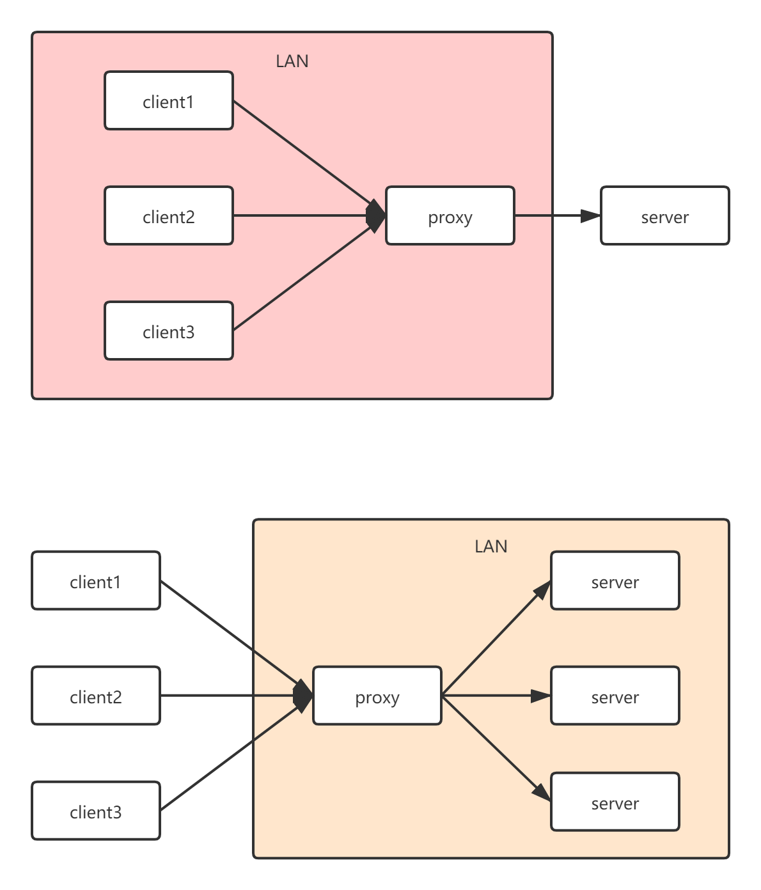

# 架构基础理论
## 微服务
微服务 (Microservices) 是一种软件架构风格，它是以专注于单一责任与功能的小型功能区块 (Small Building Blocks) 为基础，利用模块化的方式组合出复杂的大型应用程序，各功能区块使用与语言无关 (Language-Independent/Language agnostic) 的 API 集相互通信。

微服务的起源是由 Peter Rodgers 博士于 2005 年度云计算博览会提出的微 Web 服务 (Micro-Web-Service) 开始，Juval Löwy 则是与他有类似的前导想法，将类别变成细粒服务 (granular services)，以作为 Microsoft 下一阶段的软件架构，其核心想法是让服务是由类似 Unix 管道的访问方式使用，而且复杂的服务背后是使用简单 URI 来开放接口，任何服务，任何细粒都能被开放 (exposed)。这个设计在 HP 的实验室被实现，具有改变复杂软件系统的强大力量。

2014年，Martin Fowler 与 James Lewis 共同提出了微服务的概念，定义了微服务是由以单一应用程序构成的小服务，自己拥有自己的行程与轻量化处理，服务依业务功能设计，以全自动的方式部署，与其他服务使用 HTTP API 通信。同时服务会使用最小的规模的集中管理 (例如 Docker) 能力，服务可以用不同的编程语言与数据库等组件实现[1]。

> 参考维基百科：https://zh.wikipedia.org/wiki/%E5%BE%AE%E6%9C%8D%E5%8B%99

## RMI和rpc的区别
Java远程方法调用，即Java RMI（Java Remote Method Invocation）是Java编程语言里，一种用于实现远程过程调用的应用程序编程接口。它使客户机上运行的程序可以调用远程服务器上的对象。远程方法调用特性使Java编程人员能够在网络环境中分布操作。RMI全部的宗旨就是尽可能简化远程接口对象的使用。

远程过程调用（英语：Remote Procedure Call，缩写为 RPC）是一个计算机通信协议。该协议允许运行于一台计算机的程序调用另一个地址空间（通常为一个开放网络的一台计算机）的子程序，而程序员就像调用本地程序一样，无需额外地为这个交互作用编程（无需关注细节）。RPC是一种服务器-客户端（Client/Server）模式，经典实现是一个通过发送请求-接受回应进行信息交互的系统。

## soa（Service-Oriented Architecture）
面向服务的架构（SOA）是一个组件模型，它将应用程序的不同功能单元（称为服务）进行拆分，并通过这些服务之间定义良好的接口和契约联系起来。接口是采用中立的方式进行定义的，它应该独立于实现服务的硬件平台、操作系统和编程语言。这使得构建在各种各样的系统中的服务可以以一种统一和通用的方式进行交互

### 优点
1. 松耦合：由于服务自治，有一定封装边界，服务调用交互是通过发布接口。应用程序不关心服务如何被实现。
2. 位置透明：服务的消费者不必关系服务位于什么地方。
3. 可在异构平台间复用。可以将遗留系统包装成服务。
4. 便于测试，能并行开发，较高可靠性和良好可伸缩性。

## 正向代理和反向代理

正向代理中，proxy和client同属一个LAN，对server透明，对于client代理，不感知访问哪一个server；
反向代理中，proxy和server同属一个LAN，对client透明。对于server代理，不感知哪一个client来访问。

## 中间件

## 负载均衡

## Iass, pass, sass
### IaaS: Infrastructure-as-a-Service（基础设施即服务）
第一层叫做IaaS，有时候也叫做Hardware-as-a-Service，几年前如果你想在办公室或者公司的网站上运行一些企业应用，你需要去买服务器，或者别的高昂的硬件来控制本地应用，让你的业务运行起来。但是现在有IaaS，你可以将硬件外包到别的地方去。IaaS公司会提供场外服务器，存储和网络硬件，你可以租用。节省了维护成本和办公场地，公司可以在任何时候利用这些硬件来运行其应用。一些大的IaaS公司包括Amazon, Microsoft, VMWare, Rackspace和Red Hat.不过这些公司又都有自己的专长，比如Amazon和微软给你提供的不只是IaaS，他们还会将其计算能力出租给你来host你的网站。

### PaaS: Platform-as-a-Service（平台即服务）
第二层就是所谓的PaaS，某些时候也叫做中间件。你公司所有的开发都可以在这一层进行，节省了时间和资源。PaaS公司在网上提供各种开发和分发应用的解决方案，比如虚拟服务器和操作系统。这节省了你在硬件上的费用，也让分散的工作室之间的合作变得更加容易。网页应用管理，应用设计，应用虚拟主机，存储，安全以及应用开发协作工具等。一些大的PaaS提供者有Google App Engine,Microsoft Azure，Force.com,Heroku，Engine Yard。最近兴起的公司有AppFog, Mendix 和 Standing Cloud

### SaaS: Software-as-a-Service（软件即服务）
第三层也就是所谓SaaS。这一层是和你的生活每天接触的一层，大多是通过网页浏览器来接入。任何一个远程服务器上的应用都可以通过网络来运行，就是SaaS了。你消费的服务完全是从网页如Netflix, MOG, Google Apps, Box.net, Dropbox或者苹果的iCloud那里进入这些分类。尽管这些网页服务是用作商务和娱乐或者两者都有，但这也算是云技术的一部分。一些用作商务的SaaS应用包括Citrix的GoToMeeting，Cisco的WebEx，Salesforce的CRM，ADP，Workday和SuccessFactors。
