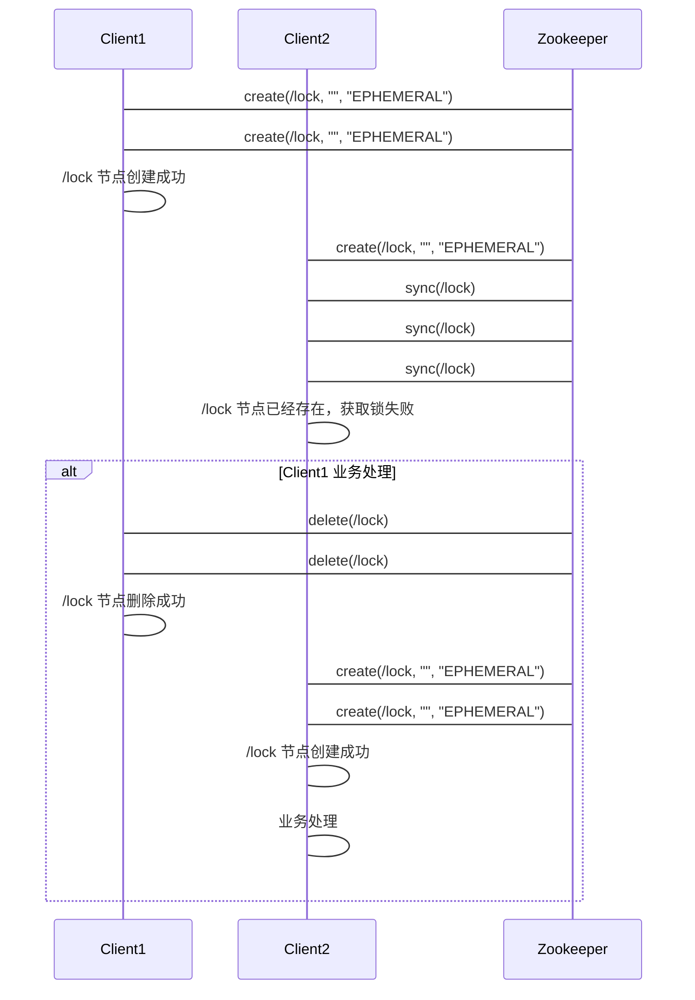

# 分布式锁

[TOC]


## 分布式锁什么？

分布式锁是一个分布式环境中的重要原语，用于保证进程间采用互斥的方式操作共享资源。通常分布式锁以SDK的形式被引入到分布式项目中，主要应用于以下两类场景：
* 提升效率：加锁是为了避免重复处理，防止任务被多个执行者抢占，避免出现大量回滚操作。
* 高可靠互斥：加锁是为了避免Race Condition导致逻辑错误，分布式场景下对强一致的要求高。


## 分布式锁实现要求

1. 可以保证在分布式集群中，同一时刻只有一个客户端获得锁。
2. 这把锁要是一把可重入锁（避免死锁）
3. 这把锁最好是一把阻塞锁阻塞锁，让线程进入阻塞状态进行等待，当获得相应的信号（唤醒，时间） 时，可以进入就绪状态，就绪状态中所有线程通过竞争，进入运行状态。
4. 这把锁最好是一把公平锁，公平锁就是线程按照执行顺序依次获取锁，好处是可以公平的让线程获取锁，避免有线程等待时间过长获取不到锁的情况，但是这种方式也有弊端：额外维护排队逻辑，额外损耗性能。
5. 有高性能、高可用的获取锁和释放锁功能

## 分布式锁的实现方式
### 1、基于数据库的分布式锁


#### 实现逻辑：


1. 原理：通过向数据表中添加记录表示加锁，删除表中记录表示释放锁
2. 加锁：先select 然后执行 insert or update
3. 释放锁：删除数据 `delete from contentMethodLock where resource_name=XXX and client_info= XXX`

#### 功能实现细节

1. 悲观锁：

   1. 加锁：每次在拿取数据的时候都会对数据上锁，``select * from contentMethodLock where client_info ='asdfb12345' and resource_name = 'order_in_stock' for update`
   2. 释放锁：提交事务，``connection.commit()`

2. 乐观锁：先在数据表中添加对应的版本号字段，每当数据库中进行数据更新时，给对应的版本号加1。

   1. `````sql
      select version from distributed_lock where resource_name = 'order_in_stock';
      
      update distributed_lock set client_info='asdfb12345',version=version+1
      where resource_name = 'order_in_stock' and version=${version};
      `````

#### 优缺点分析

* 优点：
  * 操作简单、容易理解。
  * 只用mysql就能实现，无需外部依赖。
* 缺点：
  * 频繁操作数据库性能差，
  * 满足不了高可用，存在单点问题、通过主备方式可以缓解，由于主从同步的延迟，会有数据一致性问题、
  * 需要自行实现锁的阻塞，重入等逻辑；


### 2、基于缓存的分布式锁：

#### 实现原理



1. 加锁：
   1. （1）判断加锁是否超时，如果没有超时执行setnx(key,expireTime),如果加锁成功则执行业务，如果没有没有加锁成功进入下一步。
   2. （2）get(key)获取过期时间expireTime，判断expireTime是否小于当前时间，如果不小于说明锁未过期，则继续返回加锁流程，如果expireTime小于当前时间说明锁已过期进入下一步。
   3. （3）当锁过期说明 可以加锁了，执行getSet(key, 新expireTime)操作得到oldExpireTime。
   4. （4）此时判断oldExpireTime是否等于expireTime返回值，如果不相等说明有其他客户端已经加锁了，此时继续返回加锁流程。如果oldExpireTime等于expireTime返回值 说明其他客户端没有加锁，则获取到锁
2. 释放锁：在业务执行完后，直接调用Redis中的del()方法。但是需要注意的是：*加锁和释放锁需要引入一个客户端标识，否则会有误删其他客户端锁情况*
   1. （1）进程开始获取锁成功，得到锁lockA
   2. （2）A进程在释放锁的时候，执行del()操作之前，锁lockA正好过期了，进程B得到了锁，并设置成功了lockB
   3. （3）A进程在执行del()操作时，会导致删除锁B

#### 开源解决方案

1. Redisson实现
   1. 原理图：
2. 使用lua脚本


#### 优缺点分析

* 优点：
  * 对缓存进行操作性能好。
  * 能满足高并发需求
* 缺点：
  * 实现逻辑较复杂，需要考虑各种情况
  * 不支持可重入，公平锁（需要自己实现）
  * 如果一个节点或集群出问题，主从复制没完成，造成多个客户端获取锁。

### 3、基于ZK实现分布式锁

zk分布式锁：通过有序临时节点实现锁机制，自己对应的节点需要最小，则被认为是获得了锁。




#### 实现原理


（1）客户端调用create()方法创建名为“*Lock*/node”的节点，需要注意的是，这里节点的创建类型需要设置为EPHEMERAL_SEQUENTIAL（临时排序节点）。

（2）客户端调用getChildren(“*Lock*”)方法来获取所有已经创建的子节点。

（3）客户端获取到所有子节点路径之后，如果发现自己在步骤1中创建的节点是所有节点中序号最小的，那么就认为这个客户端获得了锁。

（4）如果创建的节点不是所有节点中需要最小的，那么则监视比自己创建节点的序列号小的最大的节点，进入等待。直到下次监视的子节点变更的时候，再进行子节点的获取，判断是否获取锁。


#### 开源解决方案

1. Curator客户端实现：
2. 原理图：


#### 优缺点分析

* 优点：
  * 可靠性高，客户端宕机zk会自动喊出临时节点，相当于自动释放锁。
* 缺点：
  * 效率较低，性能较差，需要频繁创建和删除节点来加锁和释放锁
  * 需要手动实现，加锁和释放锁的逻辑。


## 总结

| 实现方式  | 性能 |      |      |
| --------- | ---- | ---- | ---- |
| 数据库    | 差   |      |      |
| 缓存      | 好   |      |      |
| zookeeper | 一般 |      |      |

