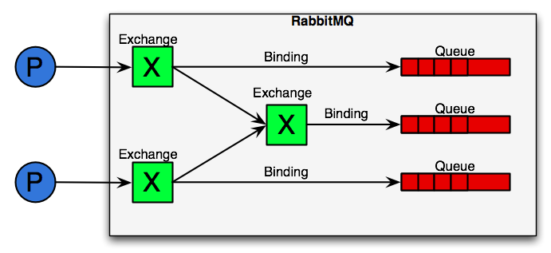
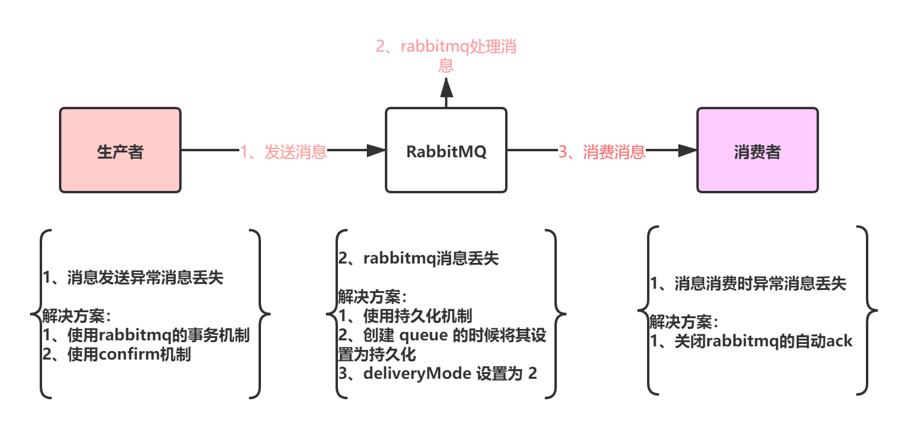

# rabbitmq的工作原理
rabbitmq是AMQP（高级消息队列协议Advanced Message Queuing Protocol）协议的实现框架，

## rabblitmq核心概念
首先来看看RabbitMQ里的几个重要概念：

* 生产者（Producer）：发送消息的应用。
* 消费者（Consumer）：接收消息的应用。
* 队列（Queue）：存储消息的缓存。
* 消息（Message）：由生产者通过RabbitMQ发送给消费者的信息。
* 连接（Connection）：连接RabbitMQ和应用服务器的TCP连接。
* 通道（Channel）：连接里的一个虚拟通道。当你通过消息队列发送或者接收消息时，这个操作都是通过通道进行的。
* 交换机（Exchange）：交换机负责从生产者那里接收消息，并根据交换类型分发到对应的消息列队里。要实现消息的接收，一个队列必须到绑定一个交换机。
* 绑定（Binding）：绑定是队列和交换机的一个关联连接。
* 路由键（Routing Key）：路由键是供交换机查看并根据键来决定如何分发消息到列队的一个键。路由键可以说是消息的目的地址。

## rabbitmq消息投递流程
AMQP模型中，消息在producer中产生，发送到MQ的exchange上，exchange根据配置的路由方式发到相应的Queue上，Queue又将消息发送给consumer，消息从queue到consumer有push和pull两种方式。 消息队列的使用过程大概如下：

1. 客户端连接到消息队列服务器，打开一个channel。
2. 客户端声明一个exchange，并设置相关属性。
3. 客户端声明一个queue，并设置相关属性。
4. 客户端使用routing key，在exchange和queue之间建立好绑定关系。
5. 客户端投递消息到exchange。
6. exchange接收到消息后，就根据消息的key和已经设置的binding，进行消息路由，将消息投递到一个或多个队列里。 exchange也有几个类型，完全根据key进行投递的叫做Direct交换机，例如，绑定时设置了routing key为”abc”，那么客户端提交的消息，只有设置了key为”abc”的才会投递到队列。

## rabbitmq exchange类型
exchange类型分为四种
* direct （直连）
* topic （主题）
* headers （标题）
* fanout （分发）
* Default Exchange

### direct（直连）
Direct Exchange – 处理路由键。需要将一个队列绑定到交换机上，要求该消息与一个特定的路由键完全匹配。这是一个完整的匹配。如果一个队列绑定到该交换机上要求路由键 “dog”，则只有被标记为“dog”的消息才被转发，不会转发dog.puppy，也不会转发dog.guard，只会转发dog。 

### topic（主题）
Topic Exchange – 将路由键和某模式进行匹配。此时队列需要绑定要一个模式上。符号“#”匹配一个或多个词，
`符号“*” 匹配不多不少一个词。因此“audit.#”能够匹配到“audit.irs.corporate”，但是“audit.*” 只会匹配到“audit.irs”`。

### fanout（分发）
Fanout Exchange – 不处理路由键。你只需要简单的将队列绑定到交换机上。一个发送到交换机的消息都会被转发到与该交换机绑定的所有队列上。很像子网广播，每台子网内的主机都获得了一份复制的消息。Fanout交换机转发消息是最快的。

### headers（标题）
Headers类型的exchange使用的比较少，它也是忽略routingKey的一种路由方式。是使用Headers来匹配的。

Headers是一个键值对，可以定义成Hashtable。发送者在发送的时候定义一些键值对，接收者也可以再绑定时候传入一些键值对，两者匹配的话，则对应的队列就可以收到消息。匹配有两种方式all和any。这两种方式是在接收端必须要用键值"x-mactch"来定义。

all代表定义的多个键值对都要满足，而any则代码只要满足一个就可以了。

fanout，direct，topic exchange的routingKey都需要要字符串形式的，而headers exchange则没有这个要求，因为键值对的值可以是任何类型。

### Default Exchange
其实除了上面四种以外还有一种Default Exchange，它是一种特别的Direct Exchange。
当你手动创建一个队列时，后台会自动将这个队列绑定到一个名称为空的Direct类型交换机上，绑定路由名称与队列名称相同。有了这个默认的交换机和绑定，我们就可以像其他轻量级的队列，如Redis那样，直接操作队列来处理消息。不过只是看起来是，实际上在RabbitMQ里直接操作是不可能的。消息始终都是先发送到交换机，由交换级经过路由传送给队列，消费者再从队列中获取消息的。不过由于这个默认交换机和路由的关系，使我们只关心队列这一层即可，这个比较适合做一些简单的应用，毕竟没有发挥RabbitMQ的最大功能，如果都用这种方式去使用的话就真是杀鸡用宰牛刀了。

## 消息可靠性

### 消息可靠性分析

### 可靠性参数设置
Rabbit队列和交换器默认情况下重启服务器会导致消息丢失，那么怎么保证Rabbit在重启的时候不丢失呢？答案就是消息持久化。

当你把消息发送到Rabbit服务器的时候，你需要选择你是否要进行持久化，但这并不能保证Rabbit能从崩溃中恢复，想要Rabbit消息能恢复必须满足3个条件：

1. 投递消息的时候durable设置为true，消息持久化，代码：channel.queueDeclare(x, true, false, false, null)，参数2设置为true持久化；
2. 设置投递模式deliveryMode设置为2（持久），代码：channel.basicPublish(x, x, MessageProperties.PERSISTENT_TEXT_PLAIN,x)，参数3设置为存储纯文本到磁盘；
3. 消息已经到达持久化交换器上；消息已经到达持久化的队列；

## 消息存储
Rabbit会将你的持久化消息写入磁盘上的持久化日志文件，等消息被消费之后，Rabbit会把这条消息标识为等待垃圾回收。

> 参考《rabbitmq实战》，rabbitmq官方文档。
